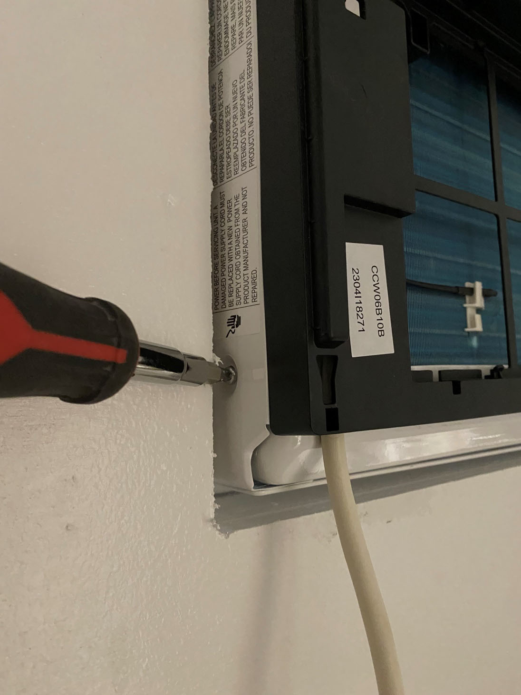
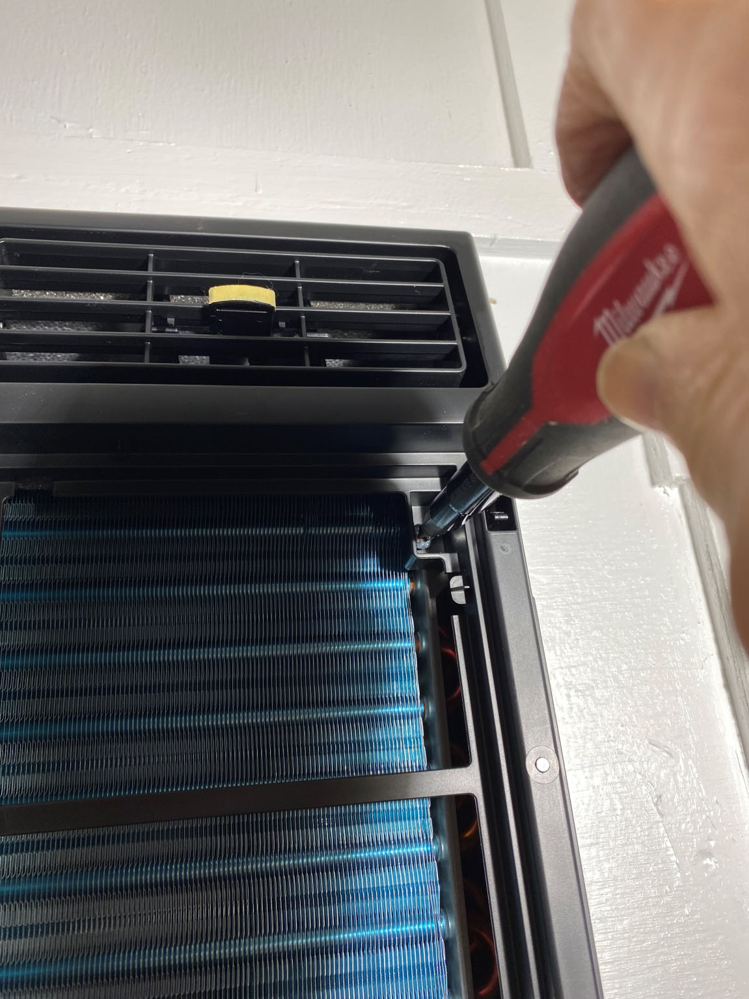
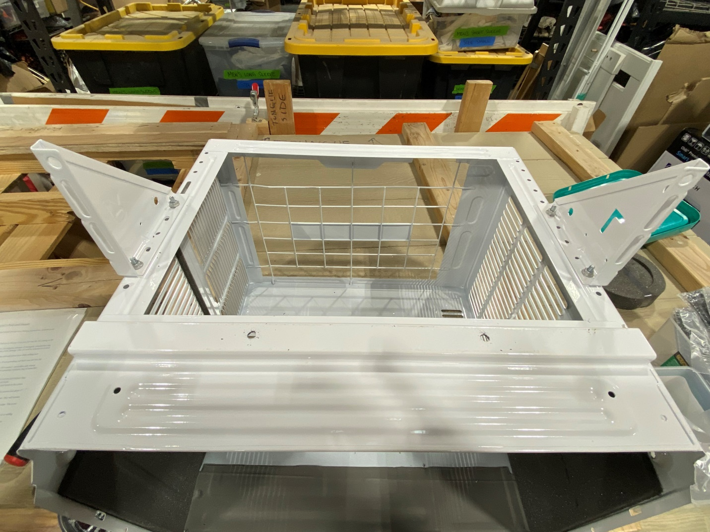
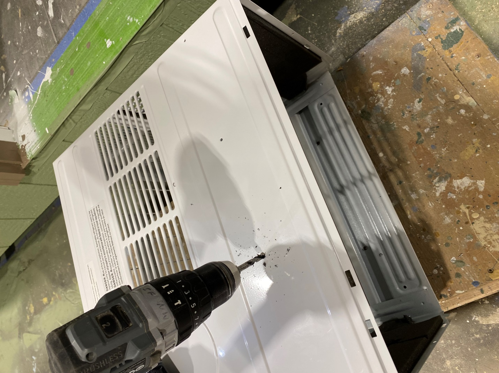
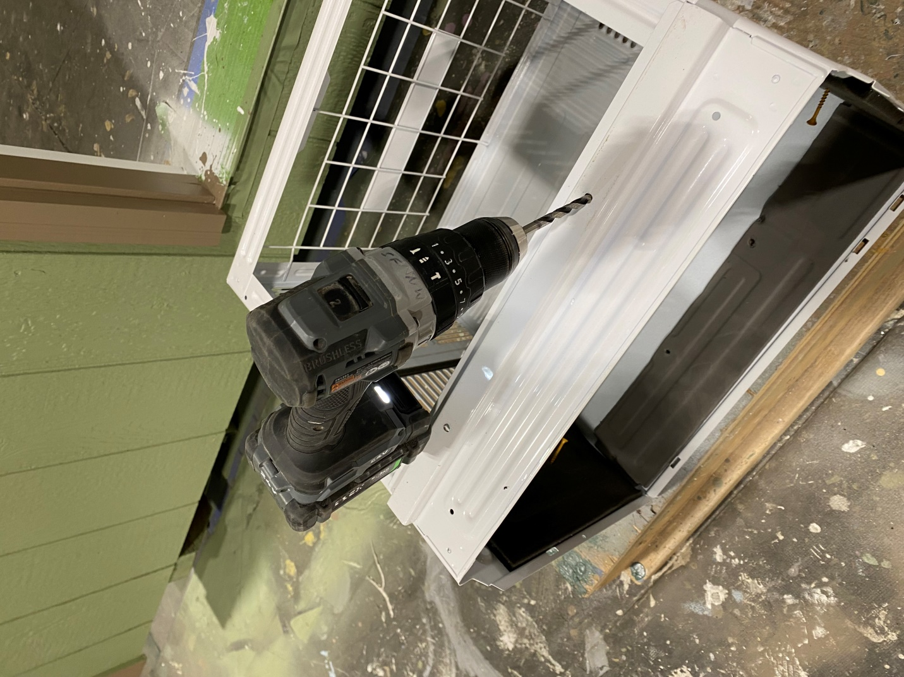
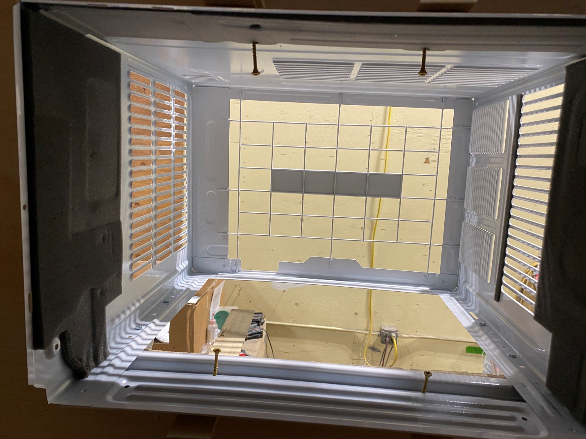

```{=typst}
#title-page[
  #text(32pt, weight: "bold")[Air Conditioner Installation]
  #v(1em)
  #text(24pt)[Friedrich Model CCW06B10C]
  #v(0.5em)
  #text(24pt)[6000 BTU Window A/C]
]
```

# Air Conditioner (AC) Prep and Install

## Tools needed

- 8mm wrench (or 5/16") and socket (socket set)
- Phillips screwdriver
- scissors to cut strapping
- white rolling cart

## Prepping the AC Unit

-   Cut strapping on the AC box. Pull up on the top of the box leaving the AC sitting on the box bottom

-   Check all corners, control panel, etc. for shipping damage. If damaged, reinstall box top, tape shut and leave a note on blue tape
    of the damage. The AC will be returned to Lowe's for replacement.

-   If the AC unit is in good condition, lift the unit and place on a white rolling cart.

-   Remove shipping tapes and tags from the AC

-   Plug in the AC and make sure it is operating. If not operating, put it back into the box for return/replacement from Lowe's, with a blue tape note

-   Remove all the installation pieces from the box.
    Not needed:
    - accordion side pieces
    - white metal bracket
    - white foam boards
    - install and operating manuals
    - bag of parts that also contains the 2 AA batteries

-   Set aside the remote, its batteries, and black foam pieces

-   Needed to install
    - R and L triangle brackets
    - package of machine screws & nuts (not battery bag)
    - roll of black foam insulation



-   Remove the Phillips screw located on the lower left side near the front, set aside

-   Open the front, white cover by pulling forward on the sides near the top. Lift and remove the cover.

-   Remove the air filter and set aside with the white cover



-   Remove the 2 Phillips screws that hold the black front cover. The screws are about 2" from the top on either side (right side shown); set screws aside

-   Push outward on the black plastic cover at about 4" from the bottom on each side. This will release the clips holding in the lower part of the cover.

-   Once the lower clips are released, lift the black cover to release the top clips. The cover will remain attached by the wiring.

-   Fold the black cover over so it rests on the top.

-   Position the AC on the cart so it can be tipped up on the front, turn the AC so it is resting on the front being careful with the power cord
     and front cover wiring.

-   Once the AC is on the front, pull up on the outer shell of the AC. You may need to wiggle the outer cover to get it to lift up. Set
    aside the outer shell.

-   Turn the inner AC back on its bottom. Reinstall the black cover using the 2 screws (see photo).  Install the lower left side screw (see photo).

-   Install the air filter and white cover.  Note that the air filter has two projections at one edge. These are handles,
    and should face outward at the top.  Then, engage the bottom of the filter with the guides at the bottom of the opening, and then flex
    the top of the filter to tuck the upper corners behind the guides near the top of each side of the opening.

-   Place the inner AC part back in the bottom packaging. Replace box top and set unit aside to be installed just before the home is ready
    to leave the Hope Factory.



-   Turn the outer part of the AC upside down. Install the R and L triangle brackets to the bottom of the unit using the four 5/16" (or 8mm)
    bolts and nuts. Insert the 5/16" bolts from inside the cover so the nut is installed on the bracket side. The front hole of the
    bracket should line up with the second hole in the cover closest to the front (see photo). The back hole in the bracket aligns with
    another hole in the AC cover. If installed with the nut inside the cover, the inner AC unit won't slide in later. Tighten the nuts securely.

{ width=75% }

-   Using a 3/16" bit and drill motor, drill two holes in the outer part of the AC cover. Drill through existing dimples on the top of the cover.
    At the bottom, drill both holes through the bottom support rail, approximately opposite the upper holes.

{ width=75% }

## Installing the AC Shell

-  Tools needed

    - impact driver with ¼" hex driver bit (station 1) and Torx bit
    - Drill motor with spade bit
    - Sawzall with long blade

-  Supplies

    - 6 Simpson screws (station 1)
    - 1-5/8" tan (yellow) Torx screws
    - Wood shims

-  After the interior plywood is installed in the home, and A/C cutout is routed out from inside paneling

-  Using the spade bit in a drill motor, bore two holes in the siding from inside the building; one at the lower right
   and one at the upper left of the A/C opening.  Using the Sawzall, cut the siding even with the 2x4 framing up from the lower right starting hole
   and then left across the bottom of the framing.  Finally, saw down from the upper right and then across the top of the opening.
   This will allow the cutout to fall away from the saw when it comes free.  Trim the corners square where the starting holes were.

- Verify that the interior plywood and exterior siding are flush with the 2x4 frame opening. Trim as needed.  Clean out any sawdust in the opening.

- Slide the AC outer part into the back of the home, one person inside to support it and another outside to install the screws into the brackets

- Adjust side to side as needed. The front, bottom support rail of the AC cover rests on the 2x4 framing.

- Install 2 Simpson screws in the upper holes of the support brackets; one on each side. Install 4 Simpson screws in each bracket on the
  lower holes, 2 on each side.

`#pagebreak()`{=typst}

- Install two 1-5/8" tan screws through the bottom of the AC outer shell into the 2x4 framing.

- Insert shims between the top of the box and the 2x4 framing, and install two 1-5/8" tan screws through the top of the AC outer shell
  into the framing. Make sure the outer top part of the AC isn't bent by the screws.  Otherwise, the black front cover will not install correctly.

- Install larger foam weather stripping that comes with the AC along the bottom of the box.



This completes the installation of the AC outer unit. The exterior and interior trim can then be installed.

## Installing the AC inner unit

Tools -- Phillips screwdriver

- Move the AC inner unit inside the tiny home. Remove the cardboard box top and take the inner unit out of the box bottom.

- Open the white front cover, lift, remove and set aside along with the air filter.

- Remove the lower left side screw (see photo on page 2).

- Remove the two screws holding the black plastic cover. (see photo on page 3)

- Insert and slide the AC inner unit into the preinstalled outer cover being careful of the attached wiring to the black cover. The inner
  AC unit should slide fully into the cover so the holes on the lower left side line up. Install the single screw on the lower left
  side (see photo).  This is all that holds the inner and outer parts together.

- Install the black plastic cover by aligning the top clips and then aligning the lower right and left side clips. Tap the side clips to fully seat.

- Install the two screws in the black cover

- Re-install the air filter and white cover (insert bottom pins first and push in the top of the cover)

- Plug in the AC and verify it is working
