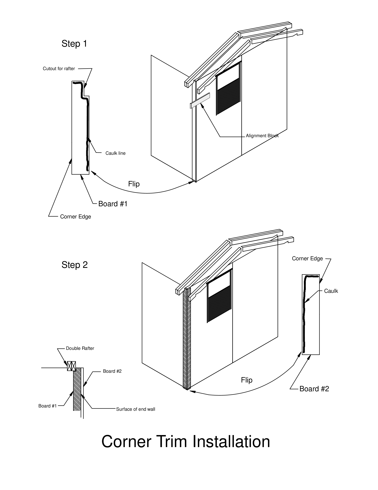
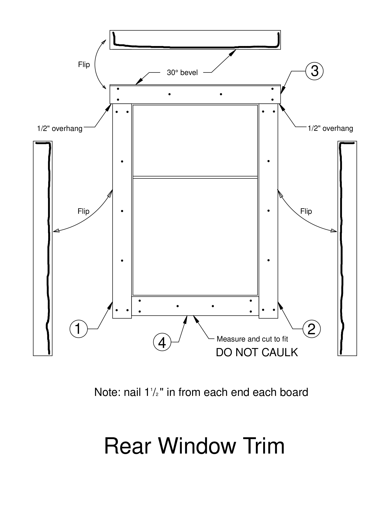
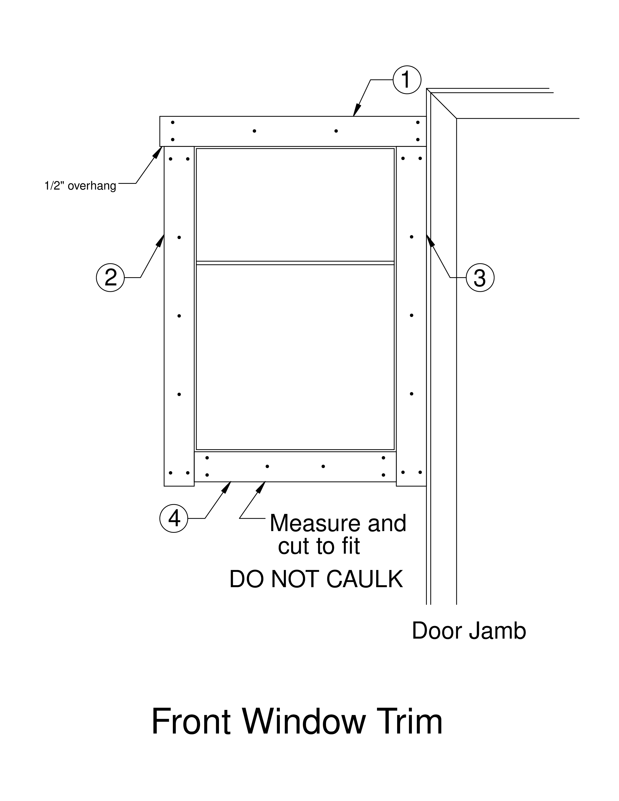
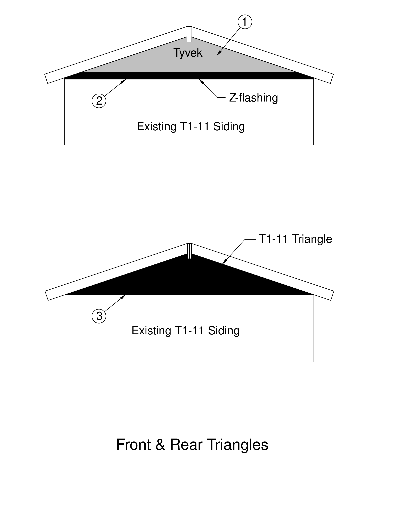

---
format:
  docx:
    reference-doc: ../manual-template.docx
    fig-align: center
from: markdown-implicit_figures
---

# CORNER TRIM INSTALLATION

Be sure that the paneling has been routed (on the right edge as you face
the front or back of the home), so that it does not extend beyond the
sidewall paneling.

## Step 1 -- Board \#1
-   Use white or gray 1x4 boards, precut to 93¼ˮ. These are on the
    whiteboard rack.
-   Cut out upper edge to fit around inner rafter
-   Line Board #1 up flush with end wall and below the doublerafters (use alignment block) mark top of the board for a vertical cut.
-   Set Board #1 next to the rafter and flush with the bottom of the wall panel, mark at bottom of rafter for a horizontal cut.
-   Draw cutout lines
-   Cut out with a jigsaw
-   Put EXTERIOR caulk as shown.
-   Flip board so that the caulk will be against the side wall, and position so that it is flush with the end wall (use alignment block.)
-   Nail (PANEL NAILS)\
    ---   2 nails about 2ˮ from top\
    ---   1 nail every 8ˮ down the middle\
    ---   2 nails about 2ˮ from the bottom

## Step 2 -- Board \#2
-   Use white or gray 1x4 boards, precut to 93¼ˮ.
-   Put EXTERIOR caulk as shown.
-   Flip board so that caulk will be against the end wall.
-   Line up the bottom of Board #2 with the bottom of Board #1.
-   Starting at the top (use alignment block) to line up outside (corner) edge of the Board #2 with the surface of Board #1.
-   Nail (PANEL NAILS)\
    ---   2 nails about 2ˮ from top\
    ---   1 nail every 8ˮ down the middle\
    ---   2 nails about 2ˮ from the bottom.

Repeat for the other three corners of the home.


# REAR WINDOW

## Step 1 & 2 -- Side Trim Pieces

-   Using precut side pieces, put EXTERIOR caulk as shown.

-   Place side piece snug up against the window. Use a block to align
    the top of each piece with the top of the window.

-   Nail (PANEL NAILS)\
    ---   2 nails 1-½" below top
    ---   1 nail in the middle of the board every 8"\
    ---   2 nails 1-½" above the bottom.

## Step 3 -- Top Piece

-   Measure from outside edge to outside edge of side trim and add 1ˮ
    (should be 32ˮ).

-   Check that the precut beveled-edge piece is that length.

-   Put EXTERIOR caulk, as shown, near the beveled edge and at both
    ends.

-   Nail (PANEL NAILS)\
    ---   2 nails 1-½" in from each end\
    ---   2 nails in the middle of the board.

## Step 4 -- Bottom Piece

-   Measure between the 2 side pieces under the window

-   Cut a piece of 1x4 that length.

-   DO NOT caulk this piece.

-   Nail (PANEL NAILS)\
    ---   2 nails 1-½" in from each end\
    ---   2 nails in the middle of the board.


# FRONT WINDOW TRIM

**Do not install this trim until the door is in place!**

## Step 1 \-- Top trim

-   Using a small piece of 1x4 placed vertically beside the window side
    furthest from the door, mark the outside edge.

-   Measure, add ½" and mark.

-   Measure from the mark to the door trim.

-   Cut a piece of top trim (with beveled edge) to this length.

-   Put EXTERIOR caulk as shown

-   Nail (PANEL NAILS)\
    ---   2 nails 1-½" in from each end\
    ---   2 nails in the middle of the board.

## Step 2 \-- Side trim away from door

-   Using a pre-cut side trim piece for side of window away from door

-   Put EXTERIOR caulk as shown
-   2 nails 1-½" below top\
    ---   1 nail in the middle of the board every 8"\
    ---   2 nails 1-½" above the bottom.

## Step 3 \-- Side trim between window and door

-   Put EXTERIOR caulk down the middle

-   Center and nail as above.

## Step 4 \-- Bottom piece

-   Measure between the two side pieces under the window

-   Cut trim piece

-   DO NOT CAULK this piece

-   Nail (PANEL NAILS)\
    ---   2 nails 1-½" in from each end\
    ---   2 nails in the middle of the board.


# EXTERIOR TRIANGLES - FRONT & BACK

NOTE - Pre-cut Tyvek, metal flashing and triangle siding are on the back shelves near the white boards.

## Step 1 - Tyvek

- Staple pre-cut Tyvek triangles to the structural triangles at the front and back of the home

- Staple along top and bottom edges and down the center studs; hammer in all staples flush

## Step 2 - Z-Flashing

- Install pre-cut piece of metal flashing
- short leg down so that flashing rests on top of the\ T1-11 siding at the top of the wall and the short leg extends down over the siding

- Center the flashing between the rafter ends

- Nail (PANEL NAILS) 3 places: near each end, and in middle

## Step 3 - T1-11 Triangle

- Install pre-cut triangular piece of T1-11 siding

- cover long leg of Z- flashing

- bottom of siding a pencil-width above the Z-flashing fold.

- if necessary, trim siding piece so that it fits against the structural triangle

- Nail (Panel Nails) every 8" along both rafters and bottom of triangle

- Caulk (EXTERIOR caulk) all exposed nails

## Step 4 -- Soffits

- Install precut soffit boards under rafters at each end of building.

- Mark location of cross blocks between rafters

- Position soffit board with angle-cut end tight against ridge beam and long edge tight against T1-11 siding. Trim as necessary to fit, so that soffit does not protrude past outside rafter.

- Nail (Panel Nails) 3 places into outside rafter, and one nail into each cross block


