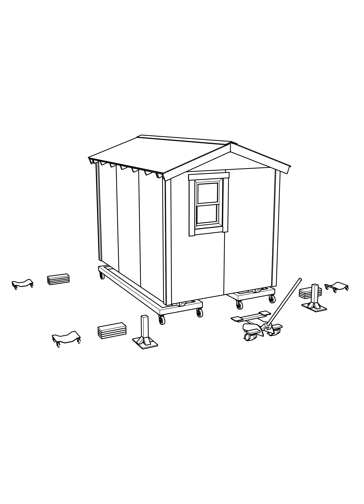

---
format:
  docx:
    reference-doc: ../manual-template.docx
    fig-align: center
from: markdown-implicit_figures
---

# Removing Iron Carts from under a Home

This is an inherently simple process, but the chances for a mishap are fairly high.  Given that the weight of a finished home is around 4000 pounds, extreme care is needed when performing this operation.

## Prepare
- Position jacks so that the center of each jack is lined up side to side with the joint line of the paneling, and so that the two square load pads are just inside the siding.  These load pads should make contact with the double 2x6 framing of the platform.  It is important that you do not try to raise the home by applying force to the bottom edge of the siding (which overhangs the framing).

- At the rear, position the 4x4 stands at either corner of the home.  In the next step, they will be positioned precisely, but having them near the right position allows the person running the jack to see how high to raise the rear of the home.

- Position triple blocks under the iron carts, so that they are about 18" from the end of the skids, and centered side-to-side on those skids.  Wrap the extraction ropes to one side of each triple block, so that when the carts roll out, they do not run over the ropes.

- Have auto dollies nearby.  It is embarrassing if you have to run off to fetch these at the point where you will need them, because the home will be precariously perched on a raised jack without a lot of support.

## Raise the rear

- Communication between the front and rear jack managers is essential, so that the home remains stable.  **Never** allow the home to be raised on both jacks at the same time.
- Make sure that the jack handle is rotated clockwise, to close the hydraulic valve and allow the jack to raise the home.  Repeatedly operate the handle to raise the rear of the home just far enough to make it possible for helpers to slide the 4x4 stands under the home.
- Position each stand so that the 4x4 post is just inside the siding; this will allow the platform frame to rest on the posts as the jack is lowered.

## Lower rear of home onto stands

- Once the stands are in position, have the helpers move away from the home, and then cautiously rotate the jack handle counterclockwise to lower the home.  This is easier to control if you grip the jack handle where the foam rubber liner covers the handle.
- When the home is resting solidly on the two posts, call out to the front, saying that this step is finished.

# Raise the front

- When the rear is solidly on the two 4x4 posts, start to raise the front of the home.  It only needs to be raised a few inches, so that the skids no longer rest on the cart.  Do not raise it further, so that the flanges at the front of the cart will help to guide the path of the cart as it is extracted.
- Have two helpers hook the ends of the extraction ropes to the front of each iron cart, one hook on either side of the skid flanges, and pull the cart straight out from under the home.  The carts can then be taken to the materials area for reloading.  If the cart path is not straight, the rear flanges will bind up on the skid, and make it very difficult to pull the cart out without pulling the home off the rear stands.

- Verify the position of the front triple blocks, making sure that they are centered side-to-side under the skids, and about 18" from the end of each skid.  This will leave room for an auto dolly to be placed between the end of the skid and the triple block in the next step.

# Drop front onto triple blocks

- Once the triple blocks are in place, lower the front of the home onto the blocks, leaving the jack just in contact with the frame, but not bearing any of the weight of the home.  This will provide additional stability in the next step.
- Position the two front auto dollies under the front ends of the skids, about 4" back from the end of the flat bottom of the skids.
- When the front is resting solidly on the triple blocks, call out to the rear saying that this is done.

# Raise rear, remove posts

- When the  front is solidly on the blocks, begin to raise the rear just far enough that helpers can remove the two 4x4 stands from the corners of the home.
- Verify the position of the rear triple blocks, making sure that they are centered side-to-side under the skids, and about 18" from the end of each skid.  This will leave room for an auto dolly to be placed between the end of the skid and the triple block in the next step.

- Lower the rear of the home by releasing the hydraulic pressure in the jack, turning the jack handle gently counterclockwise.  Leave the rear jack just in contact with the platform frame, but not bearing any of the weight of the home.
- Position the two rear auto dollies under the rear ends of the skids, about 4" forward from the end of the flat bottom of the skids.
 - When the home is resting solidly on the triple blocks, call out the front saying that this is done.

  

# Raise front, remove triple blocks

- When the rear of the home has been lowered onto the triple blocks, raise the front of the home just a few inches, so that helpers can pull the front triple blocks out from under the skids.
- Verify that the auto dollies are positioned about 4" from the end of the flat bottom of each skid, and centered side-to-side, so that when the home is lowered, each skid will rest evenly in the center of its auto dolly.

# Drop front to final position

- Once the front blocks have been removed and the helpers are clear of the home, lower the front jack all the way, so that the skids are resting on the front auto dollies.
- Call out to the rear, saying that this step has been done.

# Raise rear, remove triple blocks

- When the front of the home is down on its auto dollies, raise the rear just a few inches, so that helpers can pull the rear triple blocks out from under the skids.
- Verify that the auto dollies are positioned about 4" from the end of the flat bottom of each skid, and centered side-to-side, so that when the home is lowered, each skid will rest evenly in the center of its auto dolly.

# Drop rear to final position

- Once the front blocks have been removed and the helpers are clear of the home, lower the rear jack all the way, so that the skids are resting on the rear auto dollies.
- Pack up the 4x4 stands, the triple blocks, and the iron cart extraction straps into the storage cart.
- Return jacks and cart to storage location.

