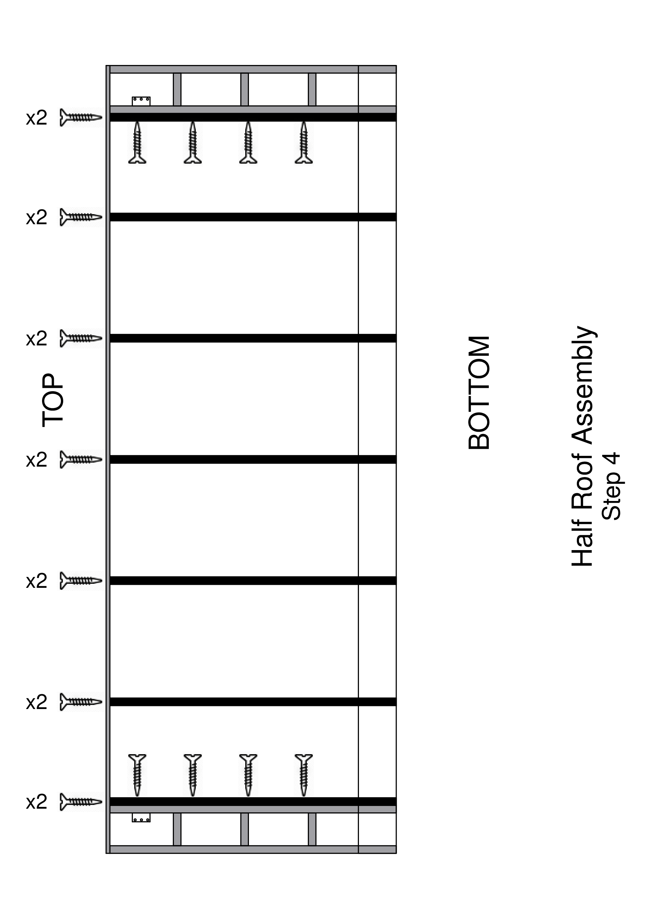
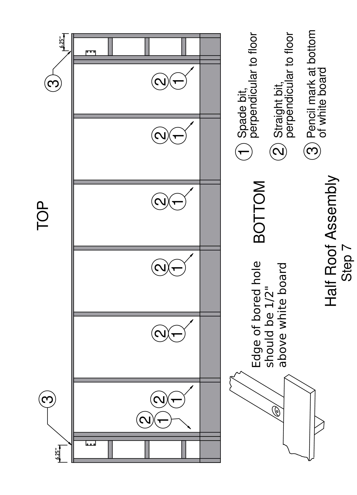

---
format:
  docx:
    reference-doc: ../manual-template.docx
    fig-align: center
from: markdown-implicit_figures
---

# HALF ROOF - SET UP LIST

-   Screw gun with T25 bit and small socket
-   Long screws
-   Short screws
-   2 A35Z angle brackets
-   Galvanized SD #10 Screws
-   Mallet
-   Clamps
-   Drill
-   3 different drill bits in plastic container
 
 
## Step 1

-   Put white 1x6 board into the top of the jig. Note that there are also 1x8 boards in the same rack. Do not use these wider boards for this step
-   Tap it down with mallet.


## Step 2

-   Prepare 2 notched 2x4 rafters by securing an angle plate to the left side of one and the right side of the other, as shown in the diagram, using 3 SD #10 Galvanized screws. **Make sure that the bottom of the angle plate is flush with the bottom of the rafter**.

-   Put in these 2 rafters one slot in from each end. Place 2 additional rafters in the end slots.\
    --- put a place holder (short 2x4) in the spot of the double rafter to stabilize first rafter
-   Pre-drill (countersink drill bit) 2 holes in the white board at each of the 4 rafters.\
    --- top of white board and top of rafter flush\
    --- top hole 1 inch below top of white board\
    --- holes in a vertical line, one inch apart\
    --- holes angled down following 2x4 rafter centerline
-   Put in LONG SCREWS\
    --- tilted down following the 2x4 rafter centerline\
    --- making sure top of rafter is flush with top of white board


## Step 3

-   Three small blocks go between the two end rafters. Start at the top, and for each block
-   Place a small 6½ inch 2x4 block between the rafters, in the space between a pair of angle irons.
-   Adjust the position of the block so that it is flush with the rafters at each end. Clamp the rafters below the block
-   Put 2 long screws into each end of the block through the rafters\
    --- position screws so that they go into the block near its vertical centerline\
    --- insert screws about 2 fingers apart, one below the other


## Step 4

-   Put a 3^rd^ rafter right next to the inner rafter of the 2 with the cross blocks.
-   Clamp those 2 rafters together
-   Put 4 long screws spaced along the length of those rafters\
    --- to attach them together\
    --- 4 screws above bottom cross block, from inside
-   Place all the inner rafters
-   Same as previous rafters, pre-drill 2 holes in the white board at each of the inner rafters\
    --- white board and rafter flush at top of white board\
    --- top hole 1 inch below top of white board\
    --- holes in a vertical line, one inch apart\
    --- holes angled down following 2x4 rafter centerline
-   Put in 2 LONG SCREWS at each rafter\
    --- tilted down to follow the 2x4 rafter centerline
-   Remove all stickers from the ends of the rafters


## Step 5

-   Place a 1x8 white board on the rafter ends at the bottom\
    --- line up and clamp the right end and then the left end\
    --- make sure white board is flush with the outside rafter on the right end
-   Working your way from the left end, align the bottom edge of the white board flush with the end of each rafter. Pre-drill and place 1 SHORT SCREW into each rafter\
    --- use funky board \#9 to push the white board out to be flush with the end of each rafter, or push the white board toward the top of the assembly if it hangs over the rafter end
-   If white board extends past the left edge of the outside rafter, use a router to trim it flush.


## Step 6

-   Pre-drill and place a 2nd SHORT SCREW at each rafter\
    --- repeat all the way across the top of the 1x8 white board


## Step 7

-   Countersink pre-drill on each of the inner rafters\
    --- See diagram\
    --- Use 13/16" spade bit\
    --- Bottom edge of hole 1/2" above the 1x8 white board\
    --- drill perpendicular to the floor, not the white board\
    --- drill bits in plastic container at station 5

-   Drill in each of those holes with a straight drill bit\
    --- bit in the plastic container\
    --- drill perpendicular to the floor

-   Make a mark on the bottom inside of the 1x6 white board (at the top of the jig) 6¼ inches in from each end. This will help to align the half roof when it is installed on the home. There is a pattern block that will make this easy; that block fits over the end of the 1x6 white board.


## Remove Half Roof

-   Remove the half roof by going down the top with a crowbar\
    --- Gently lift as you make your way to the other end\
    --- Do not force the top white board, especially at the ends.
    If gentle prying does not free the board, raise the end rafters from the bottom to free the assembly.
-   On both ends, lift the high side upwards\
    --- towards being perpendicular with the floor\
    --- it will work its way off the jig 


# HALF ROOF --- CHECKLIST

1.  White board --- 6 inch
2.  Install angle brackets (one left, one right)
3.  2 rafters each end
4.  Pre-drill 2 holes each rafter
5.  Long screws through white board
6.  Small blocks between end rafters
7.  Double rafters, place & screw
8.  Inner rafters
9.  Pre-drill and screw
10. Remove stickers
11. White board --- 8 inch
12. Pre-drill, short screws
13. Countersink pre-drill --- see diagram
14. Drill through each countersink hole
15. Alignment marks on 6 inch white board
16. Remove half roof from jig