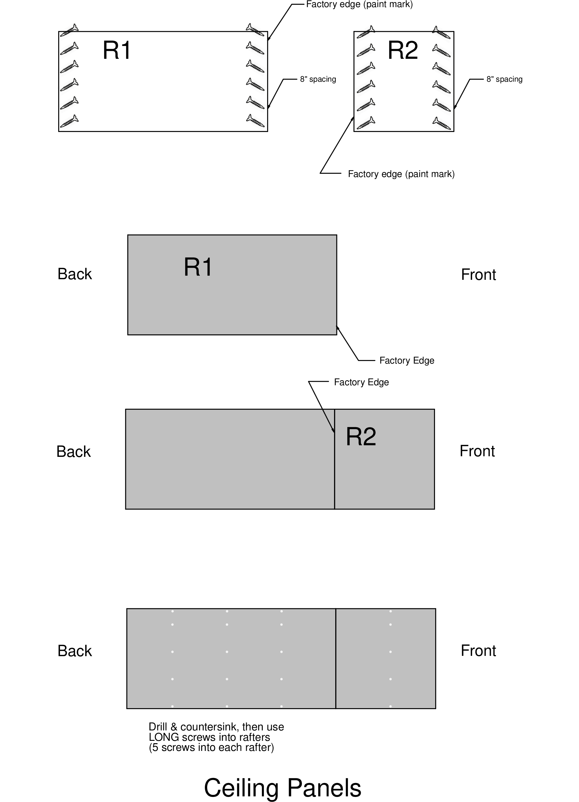
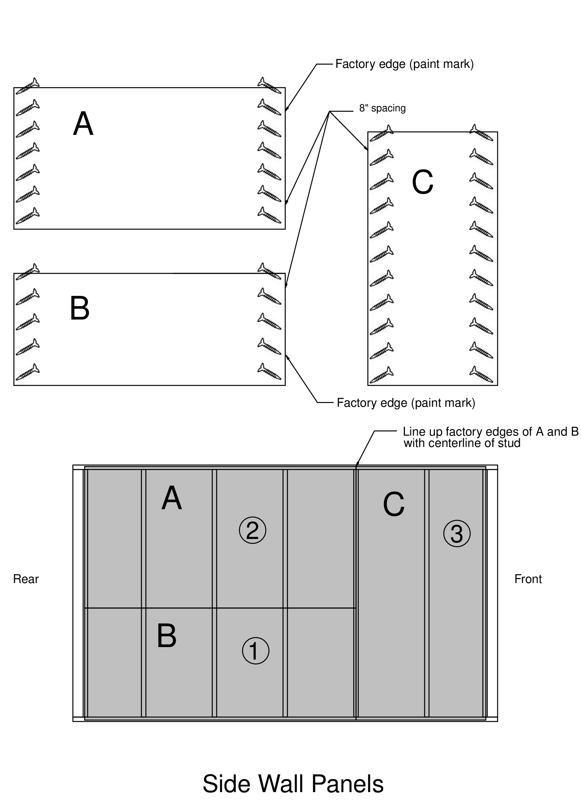
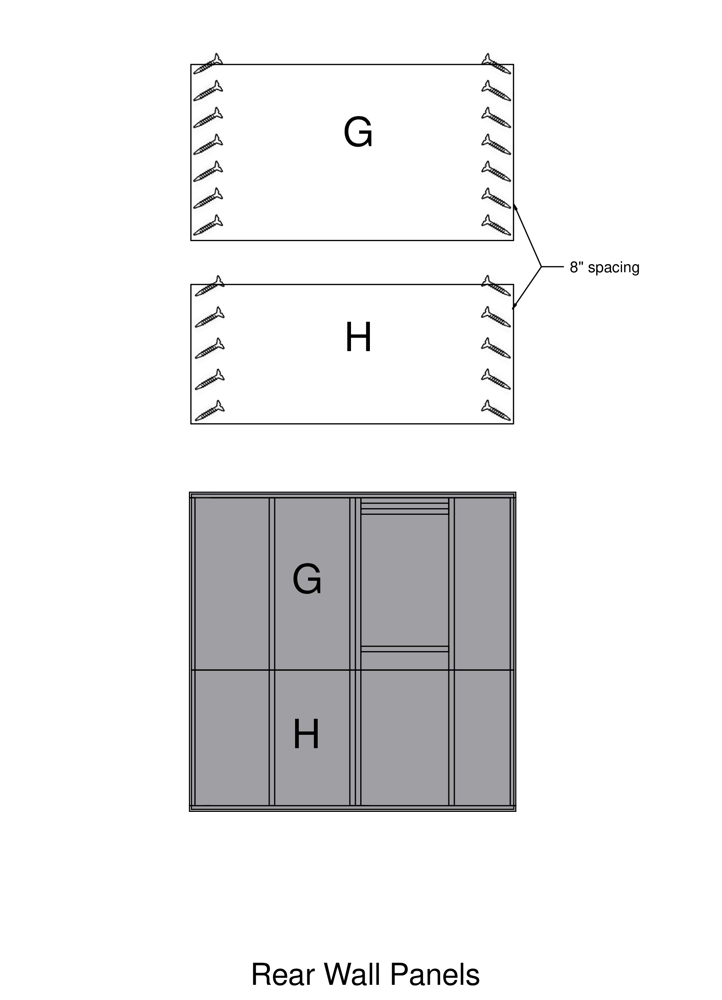
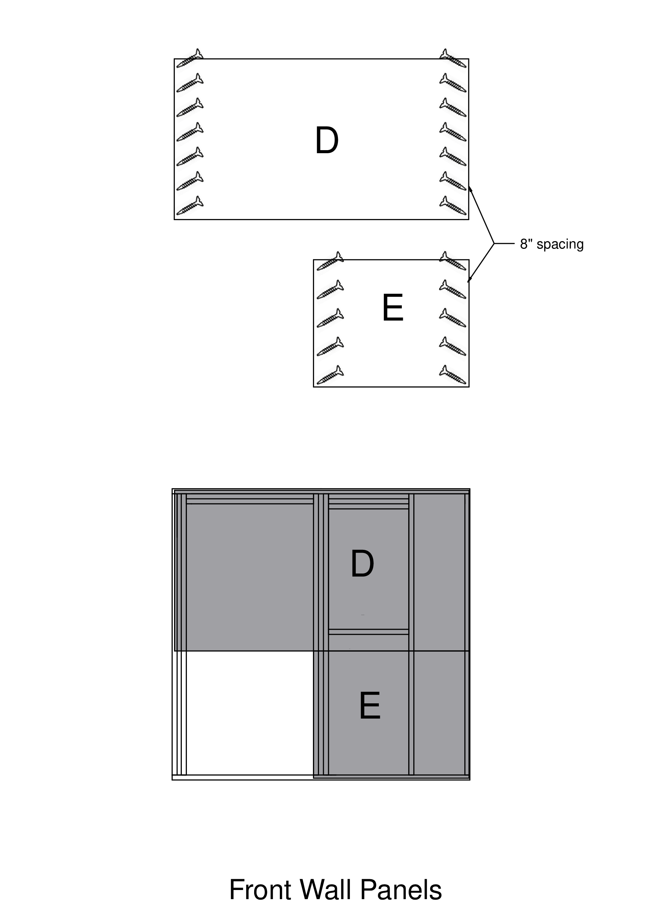

---
format:
  docx:
    reference-doc: ../manual-template.docx
    fig-align: center
from: markdown-implicit_figures
---

# INTERIOR PANELS

Tools and supplies

-   2 3-step ladders
-   2 Screw guns, with T25 bit
-   Power drill, with countersink bit
-   Pry bar
-   Pencil (to mark on ceiling and wall panels)
-   Funky Boards #3 & #4 (T-bars for ceiling panels)
-   Screw pattern boards (42" and 84")
-   A/C cutout locator jig
-   Work light
-   3" #10 screws (brown)
-   2" #8 screws (yellow)


# INTERIOR PANELS

Make sure all insulation is installed including small spaces next to the
door.

Make sure that the reference line is marked on the 2^nd^ stud and 2^nd^
rafter back from the door. If not, mark these with felt-tip pen, using
angle-iron guide.

Get the panel cart with all of the cut and labeled interior panels

## CEILING Panels R1 & R2 (two each)

**Use pencil only to mark on panels.  Ink markers cannot be painted over very easily.**

- Step 1 - **Pre-drill** (this is important)\
     --- drill ½" to ¾" from the edge, slant drill slightly to the outside edge
- Step 2 - Pre-set **LONG** screws
- Step 3 -- Install panels (Requires extra people)\
      --- Install R1\
          --- at the back, factory edge on the interior stud line\
          --- tight up against the vents; use crowbar\
      --- Install R2\
          --- factory edge at interior stud line up against R1\
          --- tight up against the vents; use crowbar\
      --- REPEAT on the other side

- Step 4 -- (**BEFORE WALL PANELS)** Inner ceiling panel screws
- Use Screw Pattern Board to mark WITH PENCIL (**[NOT]{.underline}** marker) where the screws go. Align with visible rafter end at the top, and with marks on wall top plate.
- Pre-drill and screw in **LONG** screws

## SIDE WALL Panels A, B & C

- Step 1 - **Pre-drill** (this is important)\
     --- drill ½" to ¾" from the edge, slant drill slightly to the outside edge
- Step 2 - Pre-set **SHORT** screws
- Step 3 - Install B panel first\
     --- at the back of side wall, on the floor, with factory edge on the interior stud line\
     --- at each interior stud, pre-drill and install a short screw 3/4" below the panel edge, to identify the stud locations as well as to hold the panel flat against the framing.
- Step 4 - Install A panel\
     --- at the back of side wall, on top of B, with factory edge at interior stud line\
     --- make certain that the edges of A and B at the interior stud line are lined up exactly

- Step 5 - Install C panel\
     --- line up snug against A and B

REPEAT Steps 3, 4, and 5 on other side wall

- Step 6 - Inner panel screws
     --- Use Screw Pattern Board labeled "2 Down, 3 Up" to mark WITH PENCIL (**[NOT]{.underline}** marker) where the screws go. For Panel B, use the installed screw and a mark on the floor, for a total of 4 screws per stud. For panel A, use mark on top plate and installed screw on panel B as a guide, for 5 screws total per stud. There is a separate long (84") Screw Pattern Board for 
     Panel C.\
     --- Pre-drill and screw in **SHORT** screws


## BACK WALL Panels G & H 

- Step 1 - **Pre-drill** (this is important)\
     --- drill ½" to ¾" from the edge, slant drill slightly to the outside edge
- Step 2 - Pre-set **SHORT** screws
- Step 3 - Install H panel\
     --- on the back wall, resting on the floor\
     --- at each interior stud, pre-drill and install a short screw 3/4 inch below the panel edge, to mark the stud locations.
- Step 4 - Install G, making sure the back window is OPEN\
     --- at the back wall on top of H\
     --- The window opening will be routed out later.
- Step 5 - Inner panel screws\
     ---   Use Screw Pattern Board labeled "2 Down, 3 Up" to mark WITH PENCIL (**[NOT]{.underline}** marker) where the screws go. For Panel H, use the installed screw and a mark on the floor for alignment, for a total of 4 screws per stud. For panel G, use mark on top plate and installed screw on panel H as a guide, for a total of 5 screws per stud. On either side of the eventual window cutout, mark for screws every 8" instead of using the Screw Pattern Board. This should come
    out to 7 screws on each side of the window framing on panel G.\
     --- Pre-drill and screw in **SHORT** screws


## FRONT WALL Panels D & E

- Step 1 - **Pre-drill** (this is important)\
     --- drill ½" to ¾" from the edge, slant drill slightly to the outside edge on the sides that will form corners with the side walls. On Panel E, drill perpendicular to the panel on the door side\
     --- Pre-set **SHORT** screws
- Step 2 - Install E on the front wall, resting on the floor. Line up the edge of the panel with the door frame\
     --- at each interior stud, pre-drill and install a short screw ¾" below the panel edge, to mark the stud locations and secure the panel to the framing.
- Step 3 - Install D, making sure the front window is OPEN\
     --- over the window and the top half of the doorway, on top of E
- Step 4 - Inner stud screws\
     --- Use Screw Pattern Board labeled "2 Down, 3 Up" to mark WITH PENCIL (**[NOT]{.underline}** marker) where the screws go. For Panel E, use the installed screw and a mark on the floor, for a total of 4 screws per stud. For panel D, use mark on top plate and installed screw on panel E as a guide, but mark screw positions every 8" on either side of the door frame, and either side of the window frame.\
     --- Pre-drill and screw in **SHORT** screws
- Step 5 - Rout out the door (first), the windows, and the A/C cutout\
     --- Using a spade bit, drill from outside through the paneling, near the bottom left corner of each window. After the back window is routed out, use the A/C cutout jig to locate the drill spot, and drill a starter hole.
- Step 6 - Install a 4" x 38¼" piece of ½" plywood that goes at the bottom on the narrow side next to the door.\
     --- Pre-drill along both long edges about 8" apart\
     --- Install, making sure that the edge next to the door opening aligns with the routed doorway above it.

