---
format:
  docx:
    reference-doc: ../manual-template.docx
    fig-align: center
from: markdown-implicit_figures
---

# PLATFORM - SET UP LIST

- Put construction adhesive (Liquid Nails) by heater

- Caulking gun

- Framing nail gun

- Framing nails

- Screw gun with T25 bit

- Screws --- 3" with T25 head

- Screws --- hex head for brackets

- Brackets

- Chalk line

- Mallet

- Great Stuff cans

- 12" spacer blocks marked "SAVE"

- Jenga blocks

## Step 1

- Set 2x6s into the jig to form the perimeter. Check the long 2x6s for
straightness. If not straight, be sure to place them so that the curve
is inward at the center of each board. Put 1 FRAMING nail in each of the
corners\
     --- one person holds flush on top and sides, other person nails\
     --- put jenga board placeholder where 2^nd^ board will go

- Check the frame for square: measure the diagonals; they should be
    the same. Adjust as necessary.

- Put 2 more nails (total of 3) - in a vertical line at each of the 4 corners.

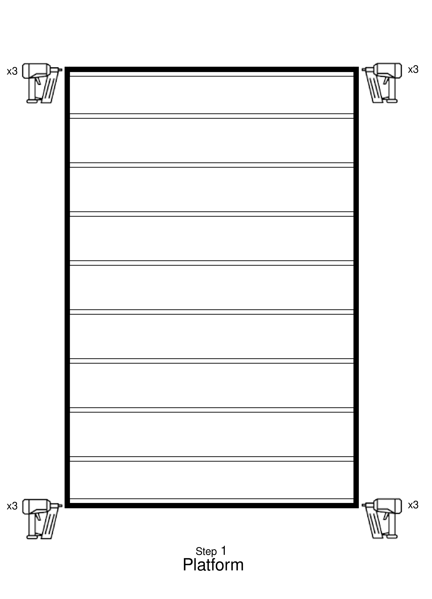

## Step 2

- Put a second 2x6 inside the ones on each short end\
    --- CLAMP them together\
    --- nail these 2x6 together 8 places, centered vertically

- Put in all the inner 2X6 joists

- Team leader\
    --- using the triangle, mark a line on the outside of the long 2x6s
    at the middle of the ends of each joist to delineate where the nails
    go.

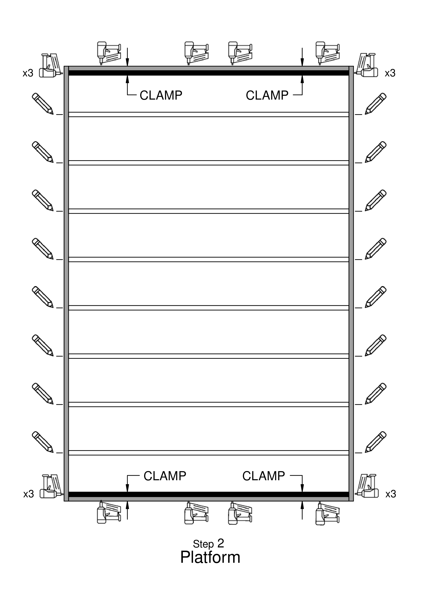

## Step 3

- Put 3 nails in a vertical line on both ends of each stud\
     --- make sure studs are flush before nailing

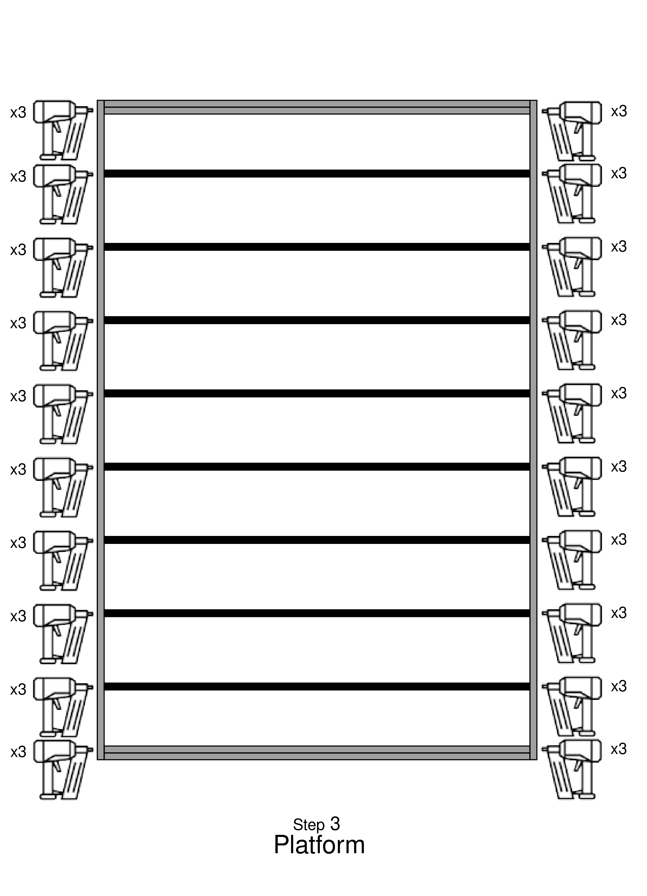

## Step 4

- Put pre-cut skids into the steel building carriages\
     --- longer part of the angled edges up\
     --- position each 4x6 skid so that 2 inches hangs over the front of
each carriage at the eventual front of the home.

- Install the alignment jigs, first to the front of the skids, and then to the back.\
     --- At the front, the cross bar should stick up above the tops of the
 skids, and the two alignment blocks should be flush with the skid tops.
     --- The skids should both be between the two alignment blocks.

-  Measure diagonally from jig corner to corner and adjust so that the jig is square.

- Pry the frame out of the jig, and lift the frame onto the pre-cut skids\
     --- At the front, the frame should be up against the jig crossbar. At
 all four corners, the frame should fit into the metal angles.
     --- Verify that the skids do not stick out beyond the back of the frame.
     If they do, they were not trimmed correctly, and this must be corrected.

- Measure the diagonals of the frame, and make sure that they are the same,
so that the frame is square.\
     --- After any adjustments, **make sure** the frame is tight against the front jig crossbar.

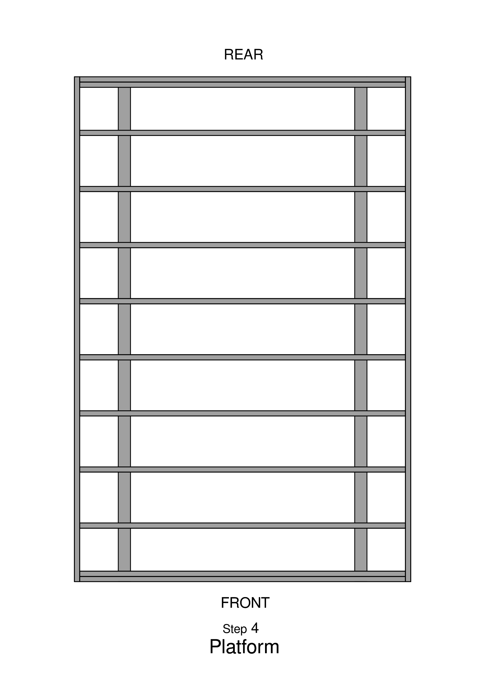

## Step 5

- Team Leader\
     --- make an X where the metal brackets should go\
     --- FOLLOW LOCATIONS on DIAGRAM\
     --- alternate inside of the skid and outside of the skid all the way to the back\
     --- make sure to make a mark on the inside stud of the double stud at the end.

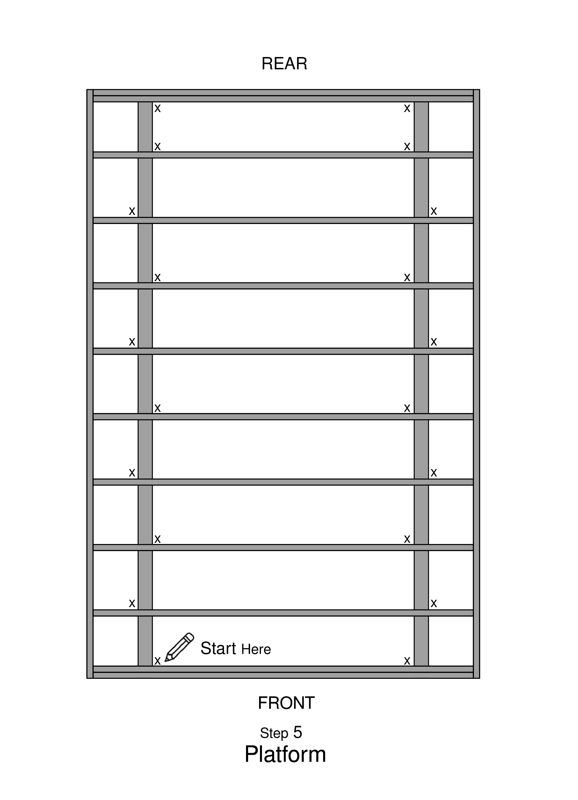

## Step 6

- At each X, screw in a metal bracket\
     --- use 6 small hexagonal screws for each metal bracket\
     --- 3 on the bottom 3 on the top, attaching the frame to the skids

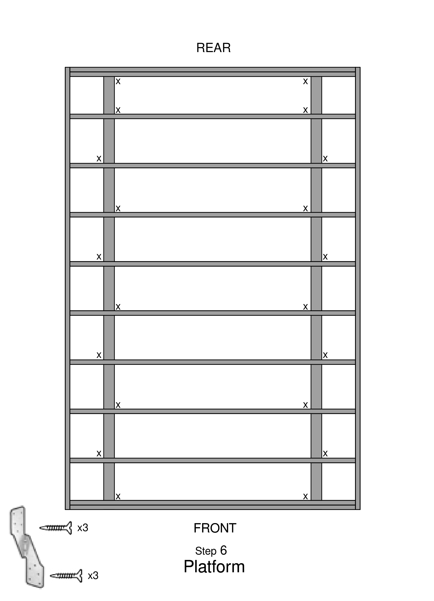

 ## Step 7

- Place blocks labeled "SAVE" in each bay, except the front and back bays\
     --- on top of each skid, centered between the joists.\
     --- DO NOT NAIL\
     --- At each end, place the "SAVE END" blocks

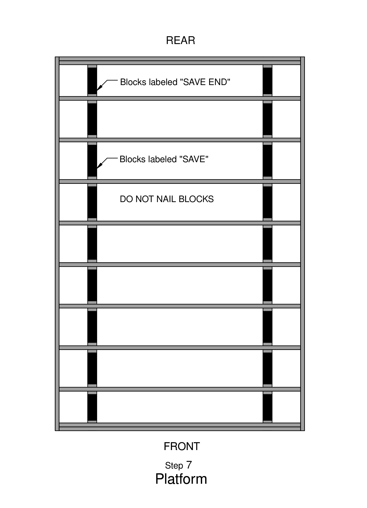

## Step 8

- Put insulation foam pieces between each stud\
     --- Cut the foam if not pre-cut. Use templates\
     --- 2 at 11^1^/~2~ inches wide by 92^1^/~2~ long\
     --- 7 at 14 inches wide by 92^1^/~2~ long\
     --- use an Exacto knife with blade all the way out

- Cut the ends to fit the length, and install with silver side UP.

- Using GREAT STUFF spray cans\
     --- put lines to fill in at all the junctions between the foam and the joists.
     --- Start with tip of spray can at the middle, and pull towards you.
     --- DO NOT SET THE SPRAY CANS ON WORK STATIONS

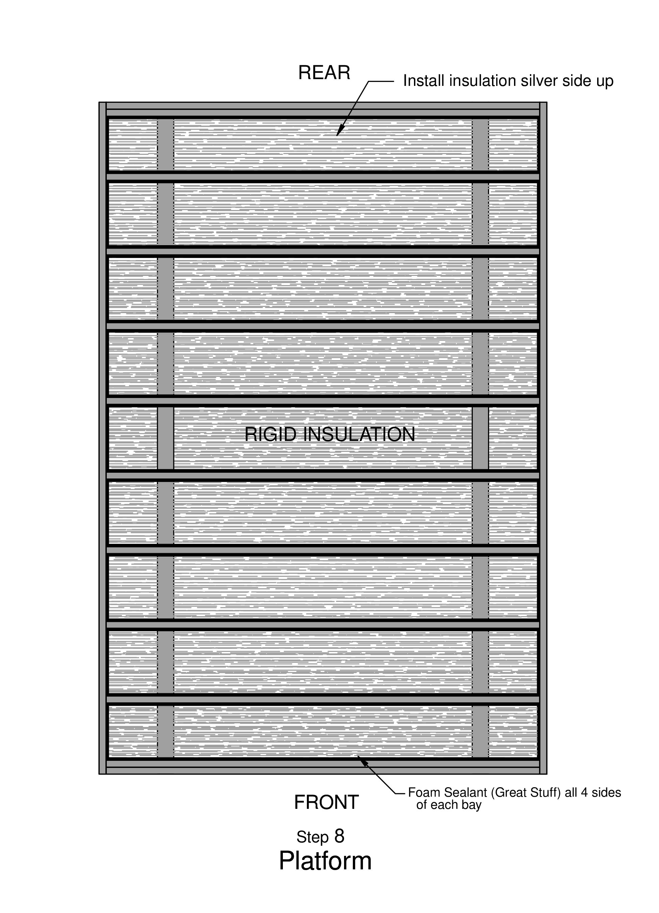

## Step 9

- Under the 1st plywood panel ONLY\
     --- put Liquid Nails construction adhesive on each of the studs and along the top and bottom

- Place the 1st plywood panel (3/4" CDX plywood)\
     --- use panels from pile labeled PLATFORM\
     --- line it up to be flush with the outer edges and the middle of the inner joist.

- Put a nail in that inner joist corner. Use that as the pivot point to line up the panel

- Nail about 8 inches apart along 2 edges using 3" framing nails.

- Put a chalk line at the intermediate studs\
     --- get up on platform and closely straddle the chalk line (joist) to push the plywood board down while nailing\
     --- walk backwards while nailing 8 inches apart.

- Nail along all chalk lines in a pattern going diagonally towards the opposite corner from where you started

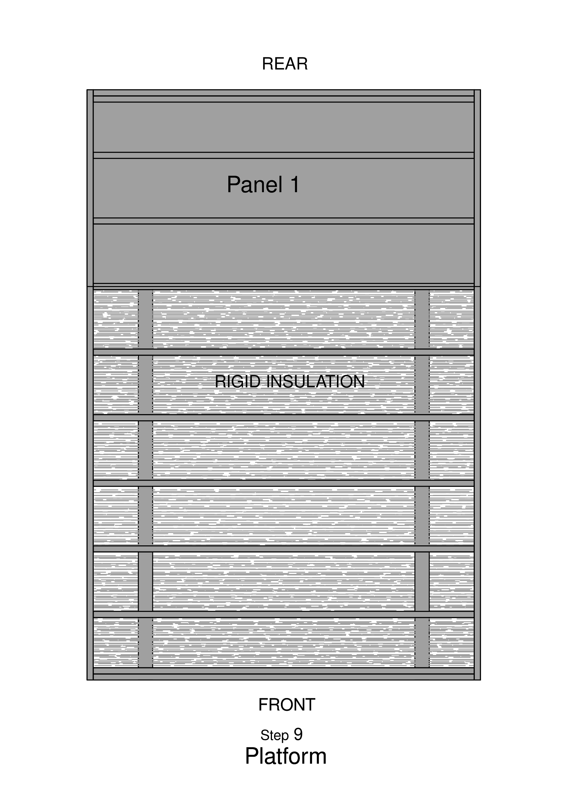

## Step 10

- Apply Liquid Nails construction adhesive to the studs that will be under the 2^nd^ plywood panel

- Place the 2^nd^ panel\
     --- use pivot point at the junction of the 2 panels.
     --- along the seam, nail about every 8 inches, slightly angled in towards the junction
      line and alternate the sides of the junction line.

- Nail along edges and chalk lines

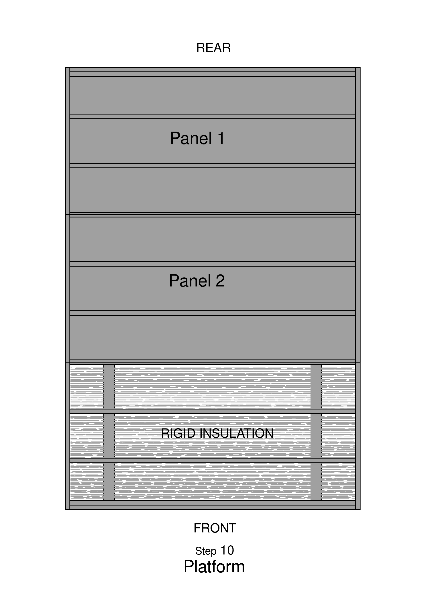

## Step 11

- Apply Liquid Nails construction adhesive to the studs that will be under the 3^rd^ plywood panel

-  Place the 3^rd^ panel\
     --- use pivot point at the junction of the 2 panels.
     --- along the seam, nail about every 8 inches, slightly angled in towards the junction line
     and alternate the sides of the junction line.

- Nail along edges and chalk lines

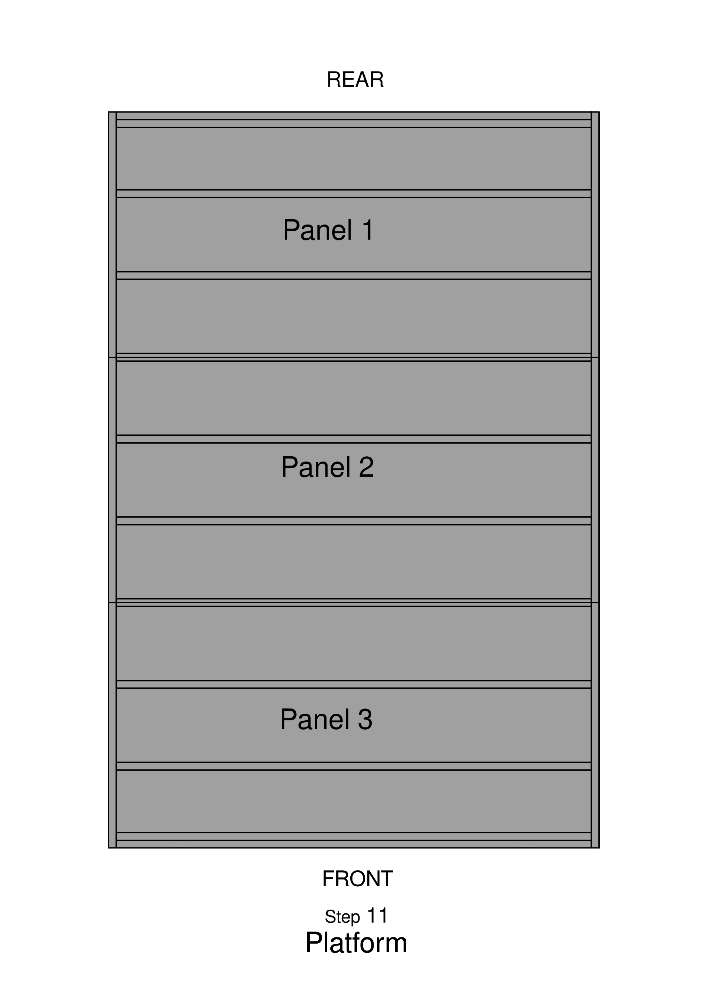

# Step 12

- The next day, if necessary, router the edges of the platform (to let the adhesive dry first).

- Draw a line 3½ inches from the edge on all sides\
     --- use the marking jig; it hangs from the back saw table. Using a felt-tip pen,
     hold it against the inside of the jig, and slide the jig along the sides of the platform.

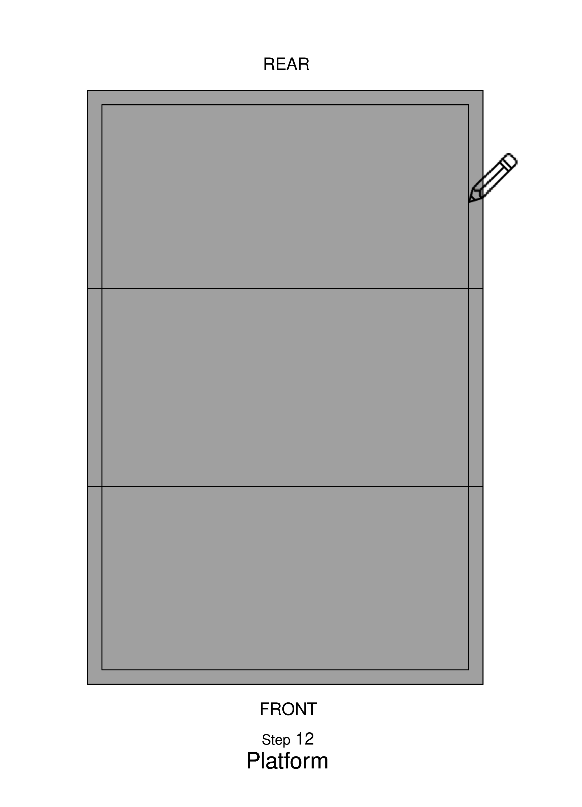