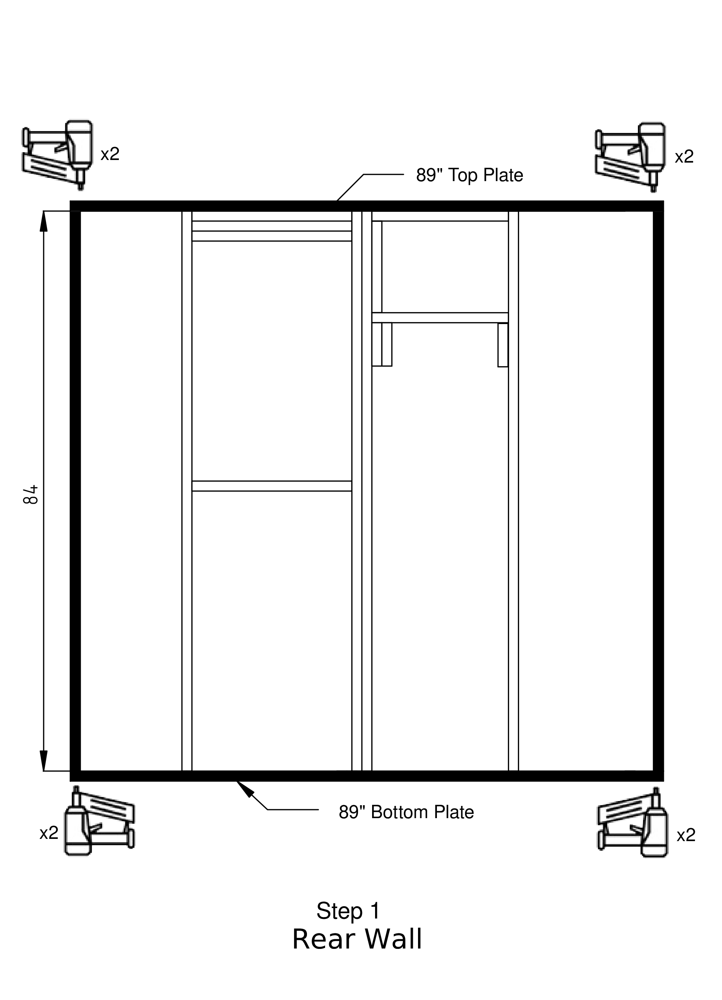
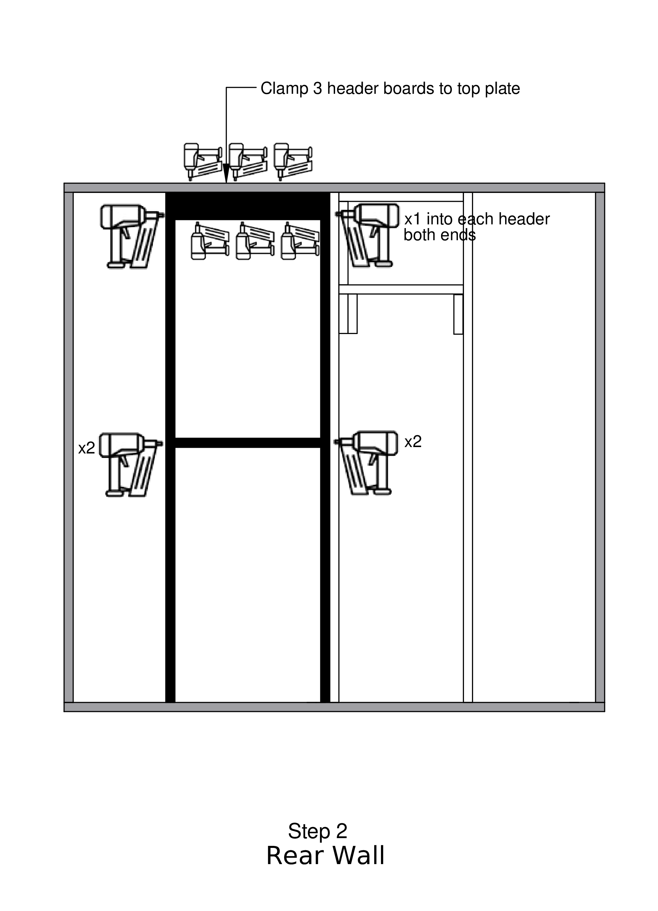
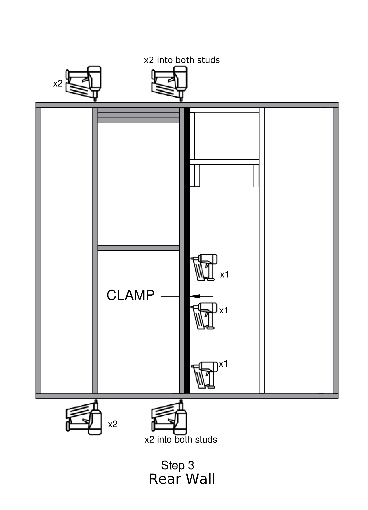
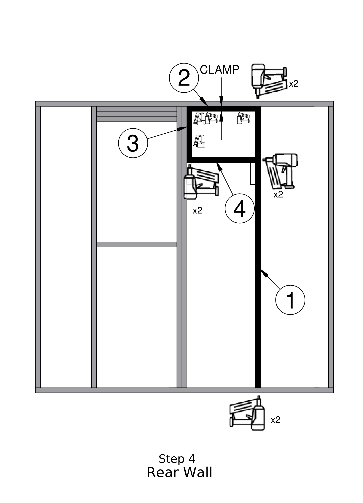
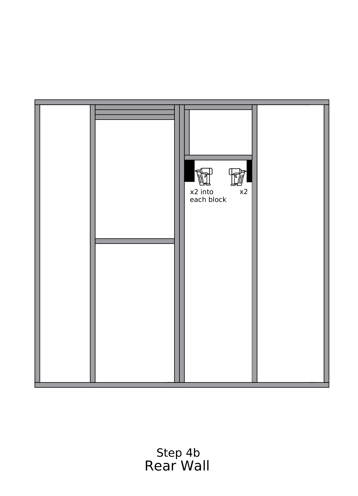
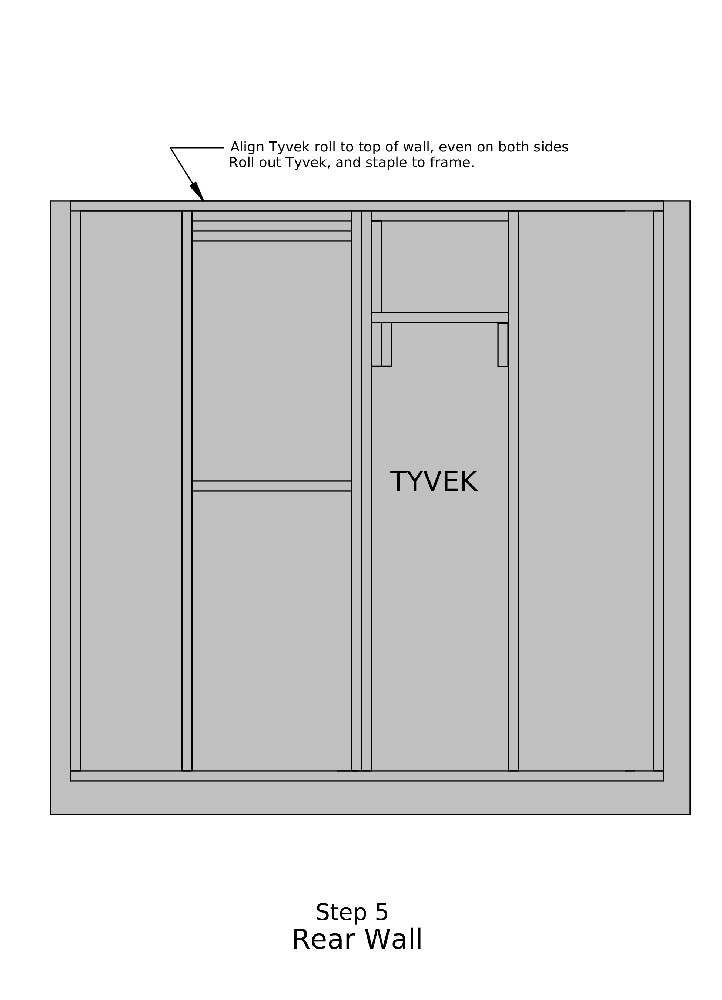
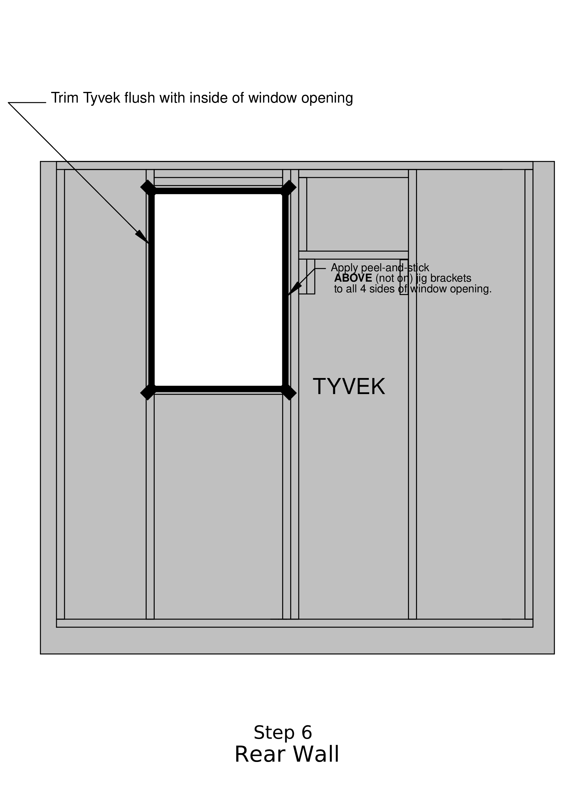
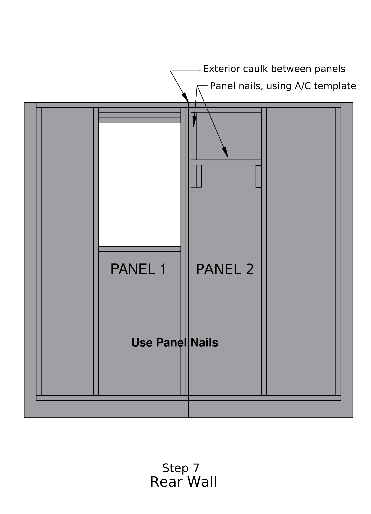
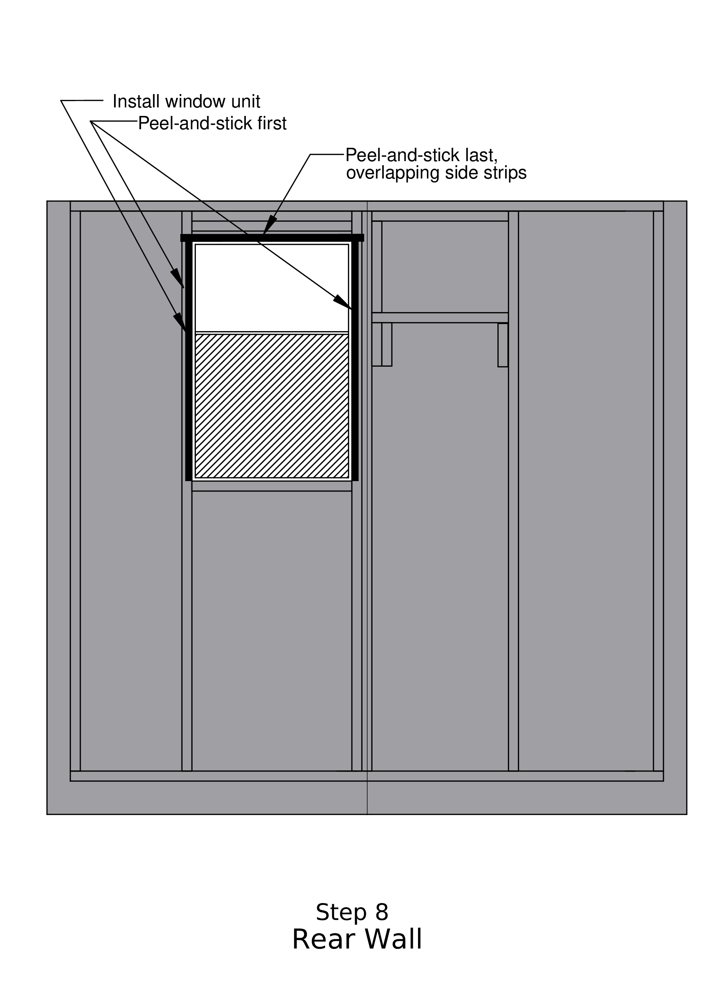

---
format:
  docx:
    reference-doc: ../manual-template.docx
    fig-align: center
from: markdown-implicit_figures
---

# REAR WALL - SET UP LIST

- Put caulk by heater
- Caulking gun
- Framing nail gun
- Framing nails
- Panel nails
- Triangle
- Drill motor with spade bit
- Screw gun with T25 bit
- Long screws
- Short screws
- Chalk line
- Stapler
- Staples
- Mallet
- Hammer
- Router
 

## Step 1

- Place 89" 2x4s on the jig for the top and bottom of the wall.
- Select the straightest 84" 2x4 stud, and reserve it for Step 4.
- Place 84" 2x4 studs on the jig for each side of the wall.
- Line up the corners to be flush on top and sides\
    --- one person holds and the other nails.
- Put 1 FRAMING nail (the longer ones) at each corner through the top and bottom 2x4s
to connect the corners, about 1/3 of the way down
- Check that the perimeter is square by measuring the diagonals; they should be the same
- Put a second nail directly under each of the first nails, about 2/3 of the way down


## Step 2

- Team leader\
    --- When boards are in place, draw a straight vertical line at the middle of each stud to indicate where to put the nails.
- Place\
    --- inner 2 long 2x4 studs on both sides of the window area. If
    studs are bowed, place so that bow is to the inside of the window
    area.\
    --- 3 short 2x4s at the top (if one is shorter, put it in the middle of the set of three)\
    ­--- 1 short 2x4 in the middle
- Clamp the 3 short boards at the top together.
- Put 3 nails into both sides of the 3 boards\
    --- 3 inside pointing out and 3 outside pointing in
- Squeeze the long boards up against the 3 short boards and put one nail through
 the long board into the end of each of the short boards on both sides
- Put 2 nails into both ends of the short 2x4 in the middle (at the bottom of the window).


## Step 3

- Secure the long boards on both sides of the window\
    --- 2 nails into the studs at the top\
    --- 2 nails into those same studs at the bottom
- Place next stud as designated in diagram
- CLAMP and put 3 nails into the double studs\
    --- ONLY in the lower half BELOW the window.
- Put 2 FRAMING nails at each end of each stud, through the top and bottom plates, on the marked lines.


# Step 4

- Place the straight stud selected in Step 1 between the double stud
    and the wall edge, as shown in the diagram.
- Place a 20-1/2" block horizontally against the top plate, as shown
    in the diagram. Clamp it in place, and nail it to the top plate.
- Place a 13-3/4" block vertically against the double stud and up against the block above.
Clamp it to the double studs and nail it to these studs in two places.
- Place a second 20-1/2" block horizontally below the vertical block as shown, and nail it to this block, and then through the newly installed stud, as shown in the diagram.
- Finally, put two nails through the top and bottom plates into the new stud.


## Step 4b
- Position a 6½" block on each side below the air conditioner opening as shown in
the diagram, and nail each block to the adjacent stud with 2 nails.
- Position a third 6½" block next to the one on the window side, and nail this block
 to its neighbor, again with two nails


## Step 5

- Line the Tyvek up to be flush with the top and overlap about 6" on the sides
- Roll out little bits at a time and staple 8" apart along the top plate, pulling the Tyvek
 so that it will be tight. At the end of the top cut off the roll with about 6" extra on the side
- Staple around the perimeter pulling so that it is tight
- Staple along ALL of the inner studs, across the top and bottom of the window .and across the bottom of the A/C blocking


## Step 6

- Cut out the Tyvek where the window goes on all 4 sides
- Using the pattern board, cut Peel-and-Stick flashing for the sides and top and bottom of the window opening ("inner long" and "inner short").
- Put peel and stick around the window opening.\
    --- half of each strip sticks up above the framing\
    --- flashing wraps around the corners\
    --- use a knife to slit the flashing above the frame at each corner, and fold down over the Tyvek.

**IMPORTANT** --- Be sure to put the peel and stick [ABOVE]{.underline}, not on the brackets on the jig.

- Add 4 small pieces of Peel-and-Stick at the corners of the window, as shown in the figure


## Step 7

- Place Panel 1 with window cut out
- Nail (PANEL NAILS)\
    --- along top, outside edge, bottom, and internal studs\
    --- use chalk lines\
    --- DO NOT nail around the window or on center edge
- Caulk along the center edge of Panel 1.
- Place Panel 2
- Nail (PANEL NAILS)\
    --- Using body weight, seal the center seam and nail at an angle, starting about ½" away from the panel edge\
    --- along top, outer edge, bottom, and internal studs.\
    --- use chalk lines
- Position the A/C nailing template over the top center of the wall, against the jig stop marked, and make pencil marks at the spots indicated at the edges of the template. Nail (PANEL NAILS) at each    


## Step 8

- Place the window screen-side down on a convenient spot on the wall.\
    --- apply caulk on the opposite side from the screen, the edge that
    will lie on the panel. Caulk only the sides and the top, NOT on the
    bottom flange\
    --- caulk line should be in the middle of the window flange
- Place the window into the window opening\
    --- SCREEN at the BOTTOM facing up
- Put SHORT SCREWS around the window\
    --- 4 on each side and 3 on top and bottom
- Team leader: Using a piece of 1x4 trim, draw a pencil line on all four sides of the window, to show Where the trim will go
- Put peel and stick on 3 sides of the window.\
    --- Using the pattern board, cut two "outer long" pieces and one "outer short" piece.\
    --- Align each piece against the corners of the window, sides first, then the top\
    --- Make sure it does not extend beyond the pencil lines\
    --- NOT on the bottom of the window
- Gently pry the top and bottom plates to raise the wall out of the jig, and place blocks under these boards.
- Staple Tyvek to underside of panel, both sides and bottom
- Trim Tyvek on both sides and bottom. Save the bottom piece.
- Caulk all nails after tilt-up.

