---
format:
  docx:
    reference-doc: ../manual-template.docx
    fig-align: center
from: markdown-implicit_figures
--- 

# Secure Walls to Platform

* Equip two crews of two people with screw guns and brown #10 x 3” screws, and have them install 4 screws in each bay of all four walls, through the bottom plate into the platform, as shown in the diagram.

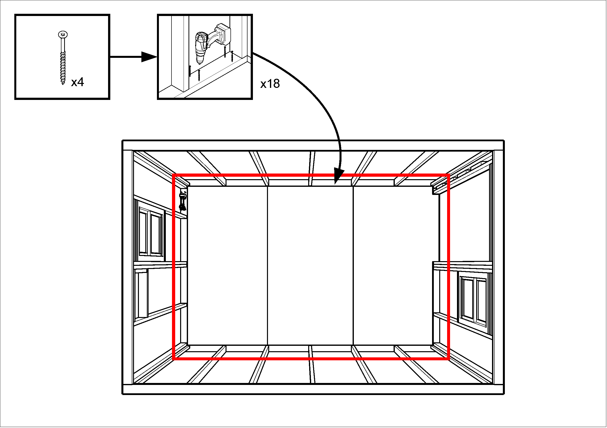



## Reinforce Corners
* Have one person install 5 #10 x 3” screws in each wall corner

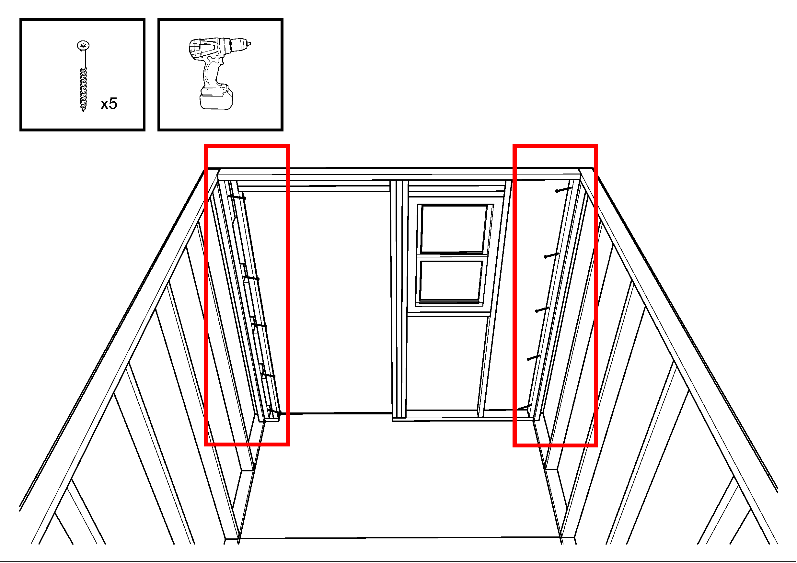{width="72%" height="72%"} 

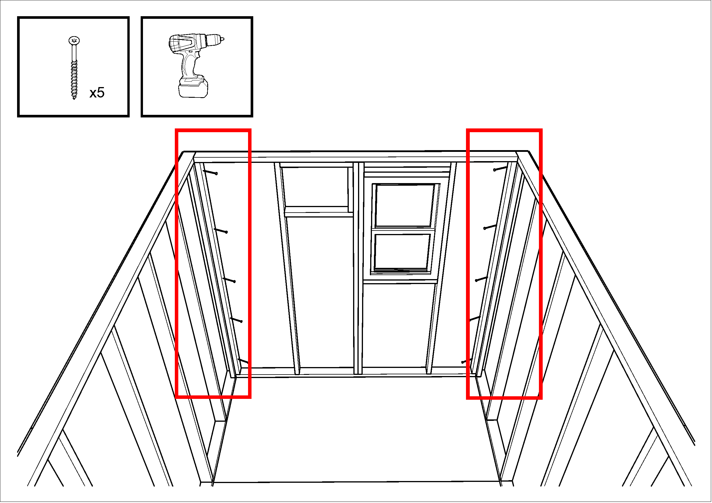{width="72%" height="72%"}

<!--- 
This is an implied page break - avoids an empty page being generated
---> 
## Nail Exterior to Platform
*	Using panel nails and working from the outside of the home, nail through the wall paneling into the base of the platform frame about 1” above the bottom of the paneling, every 8” all the way around the home.
*	Again, using panel nails and working from the outside of the home, nail the edges of the front and rear wall panels to the side-wall framing, about 1” in from the edges of the paneling, and 8” apart all the way from bottom to top of each corner.
*	Verify that the exterior paneling is nailed to the frame around the top and sides of the front door.  If not, nail that at this stage (every 8”).

## Prep Interior
*	Using a reciprocating saw (Sawzall), cut through the bottom plate of the front wall at each side of the doorway.  This should free the 2x4 so that it can be removed.  Use a knife to cut the Tyvek even with the top of the platform, and then use the Sawzall to cut the paneling at the bottom of the doorway so that it is flush with the top of the platform.
*	Using the angle-iron gauge (in the pencil cup in #4 workstation) and an ink marker, draw a line down the center of each of the “magic” studs.  These are the studs on the side walls at the rear of the second bay (4’ from the front wall).
*	Using a speed square, draw a 6” mark on the subfloor where the center of each stud is.  On the top plate of each wall, mark (freehand) where the center of each stud is.  These marks will be used by the people installing wall panels.
*	Using panel nails, nail the paneling to the platform across the bottom of the doorway.



# Install Structural Triangles

## Setup 

*	Position two 12-foot ladders, one at each end of the building.
*	Preset brown #10x3” screws in each of two structural triangles, as shown in the diagram a couple of pages on from here.  In the two center bays, there are four screws, angled enough that you could drive them in with an impact driver.  In the two outer bays, there are two screws angled in from one side of the triangle, starting about ¾” in from the edge of the bottom plate.  Then there are two screws driven in vertically about 1” toward the center from the seam between the bottom plate and the angled side of the triangle.

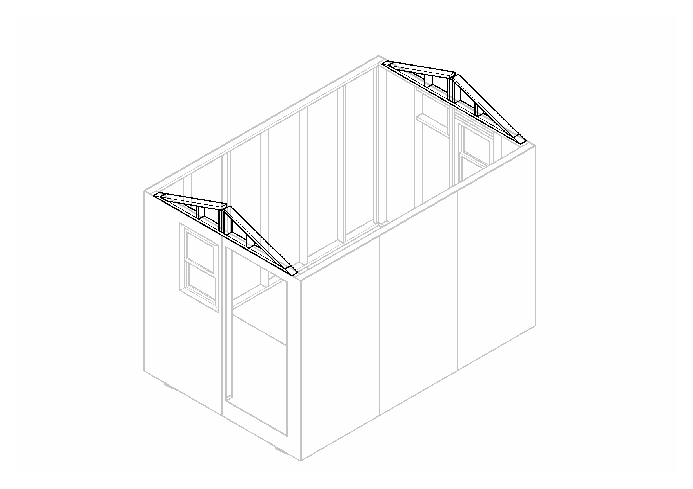



## Align Triangle

*	Position a triangle on the front wall, and, with a helper inside the home, center it from side to side.

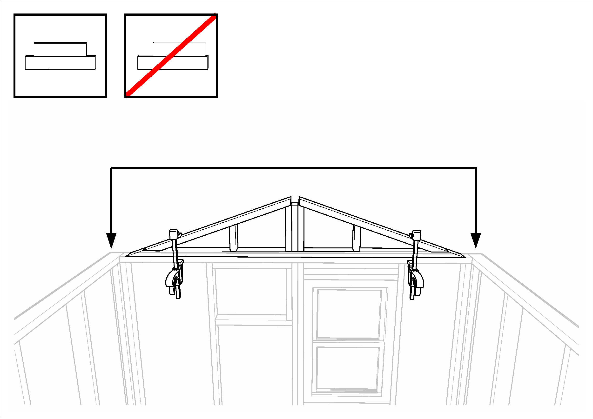



*	Verify that the bottom plate of the triangle is flush with the inside wall framing all the way across the front wall.
*	Clamp the triangle to the wall top plate (or door opening) about 6" from each end.

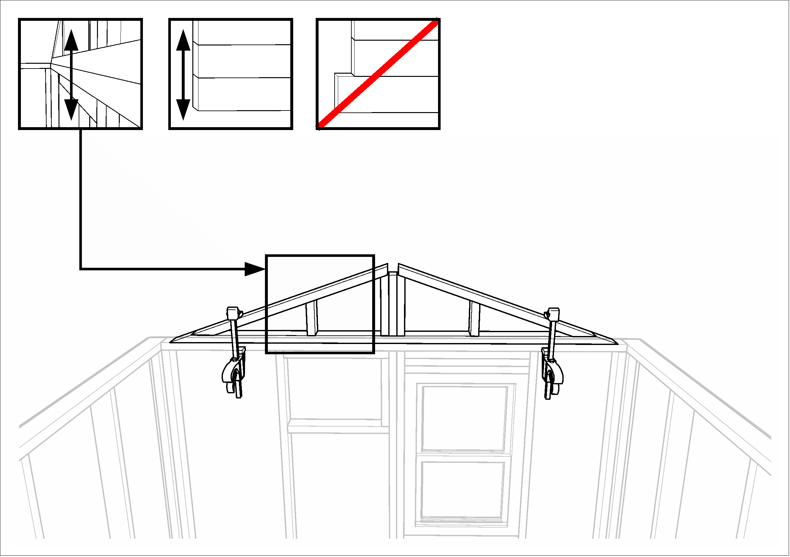



## Attach Triangles

*	From the ladder, drive all the preset screws into the wall framing to secure the triangle.
*	Repeat these last three steps on the rear wall.



## Prepare for Half-Roof Installation

While these tasks are being completed, have two crew members position a half-roof assembly against each of the side walls, with the 1x8 white board at the bottom and facing away from the wall.  Check that there is a pencil line drawn at 6 ¼” from the front of the 1x6 board (the top of the half roof) all the way down and across what will be the bottom of the half roof when it is installed



# Raise Half-Roofs

*	Assign two experienced crew to the front and rear ladder positions.  Make sure each one has two clamps, a screw gun, and at least 4 yellow #8 x 1½" screws.
*	Assign a third crew member to a 3-step ladder inside the home, to assist in final positioning of each half roof.  Position this ladder between the studs, not aligned with a stud, to avoid having a roof rafter come down on the crew member’s head.
*	Introduce Funky Boards #3 and #4.
*	Gather the lifting crew; you will need 7 or 8 people
*	Explain to the rest of the crew how the half roof assemblies will be raised. Five or six people will lift the half roof up about 4 feet off the floor, and then two funky-board wielders will push it up so that the two ladder crew and the interior person can lift it the rest of the way up.  Warn these two to push up at a 45° angle, so that the half-roof slides onto the building instead of falling backwards onto the crew.  Remind the rest of the crew on the ground to take notes, because they will get to do the second half-roof.
*	Lift the first half-roof.

{width="80%" height="80%"}

{width="80%" height="80%"}

{width="80%" height="80%"}



## Align First Half-Roof

*	The ladder crew guide the 1x6 white board into the central notches in the structural triangles.  If necessary, the ladder crew may ask for help from the people on the funky boards, to lift (temporarily) the rafter ends either at the front or rear so that the half roof is properly positioned.
*	Then the front ladder person aligns the assembly so that the mark on the half-roof is even with the outer edge of the front structural triangle.



## Raise Second Half-Roof

*	Rotate ground crew members who were standing out, and position everyone on the other side of the home for the second half roof lifting.
*	Once the ladder crew have repositioned their ladders, lift the second half roof into position.

{width="80%" height="80%"}

{width="80%" height="80%"}


## Connect Half-Roof Assemblies

*	The front ladder person leads the alignment of the two half roof assemblies, so that the ends of the 1x6 boards are flush.  Once this is done, both front and rear ladder crew clamp the 1x6 boards together both horizontally and vertically.  Placing the vertical clamp first allows the boards to slide past each other more easily before applying clamp pressure horizontally. Then drive 4 #8 x 1½ screws into the white boards, to secure the two halves together.



## Create Center Beam

*	In each bay (between the rafters), clamp the two white boards together, first vertically and then horizontally, to align them and make a tight joint.
*	insert four #8 x 1½" (yellow) screws, two above and two below the centerline, and about 4” from the rafters.  Alternate directions of the screws from one bay to the next.

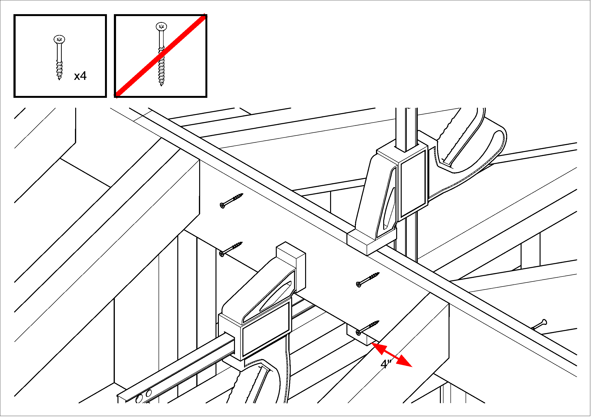

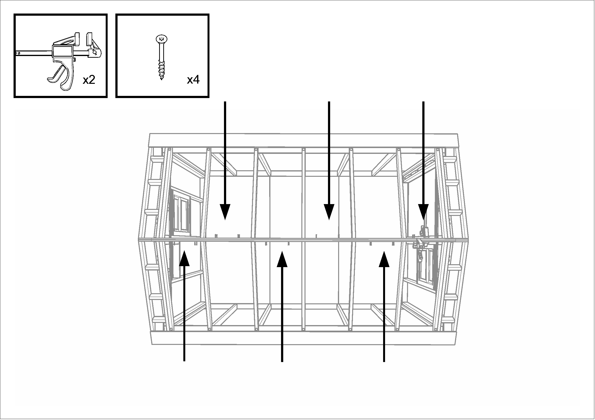



# Secure Roof

## Align Half-Roof with Walls

*	Using the angle-iron guide in Station #4, mark the centerline of the “magic” rafters; these are the ones to the rear of the second bay.
*	Align the “magic” rafters with the stud just below them.  Using a clamp, pull each of these rafters either forward or back so that it lines up exactly with the wall stud immediately below it.  If necessary, have a second person use a mallet to assist.  The place to aim the mallet is on the end rafter at the point where the lowest block is screwed to the rafter.  If you hammer on the rafter end, something will split.

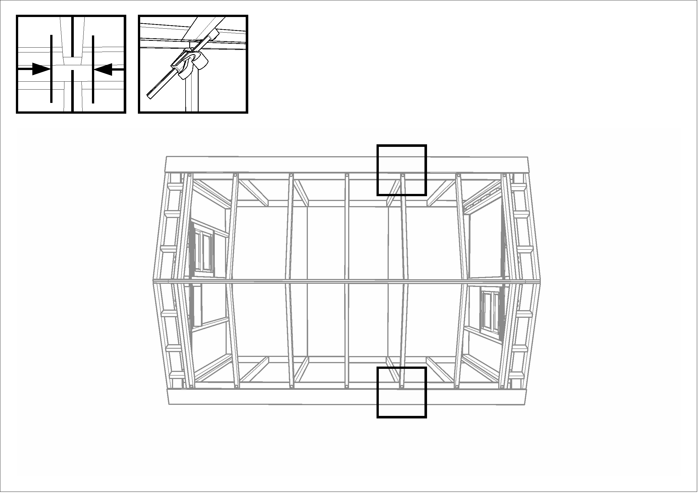



## Install Magic Stud Lag Bolts

*	Install lag bolts in these two rafters, screwing them down into the top plate of the side wall.

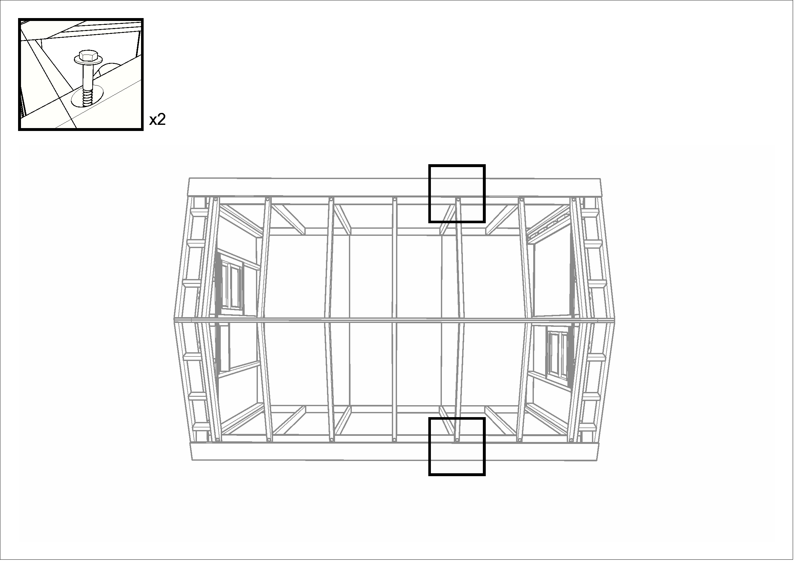


## Secure Brackets

*	At the peak of the roof, there are two steel brackets.  Install three galvanized hex-head screws in each bracket to secure the roof to the structural triangles.

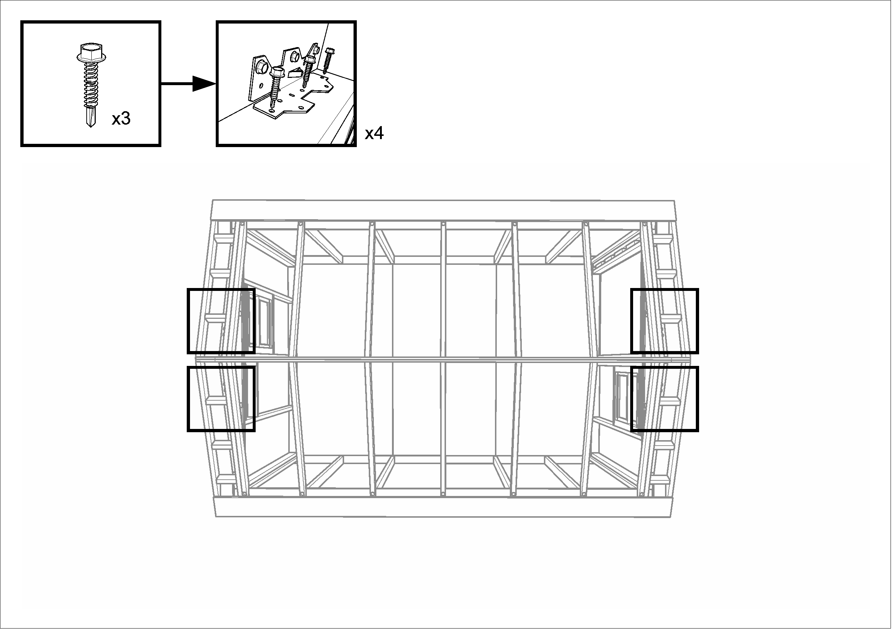


## Install All Lag Bolts

*	After these brackets are secured, install lag bolts in all the other rafters.

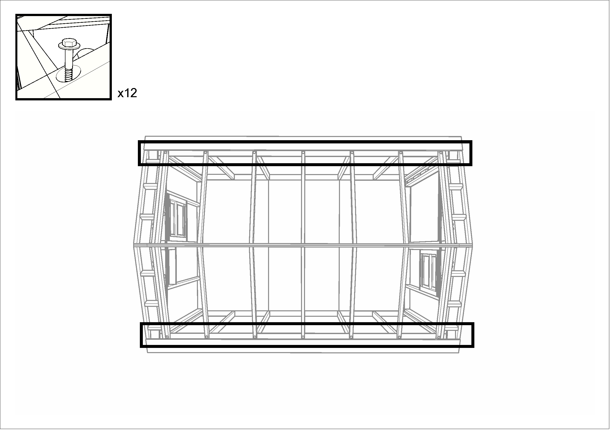



# Install Bird Blocking

*	Collect a set of bird blocks from the tall shelves.  There should be four blocks labeled “E” (for the end bays) and eight blocks unlabeled (for the middle bays).
*	One crew member is stationed on a ladder outside the home; the other, inside, has a screw gun and a box of #10 x 3" screws.
*	The outside person positions each block, tapping gently with a mallet, so that it is flat against the top plate of the side wall, and tucked just under the edge of the white board at the bottom edge of the roof. If a block is shorter than the space between the rafters, it should be centered; if it is too long, cut it off with a chop saw

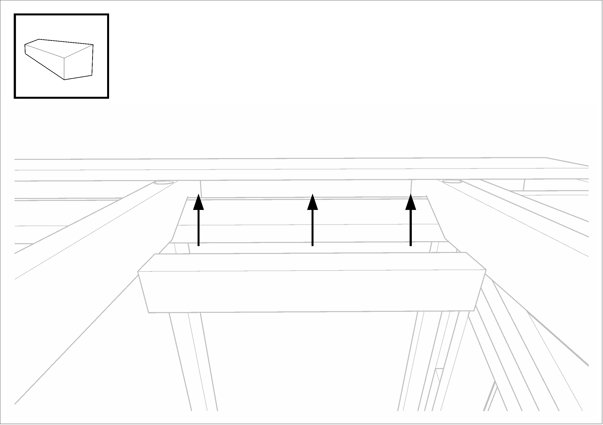


## Attach Bird Blocking

*	When a block is in position, the inside person drives two brown screws up through the top plate of the side wall into the bird block.
*	The outside person then inspects the block to make sure that no screw ends are visible on the outside of the home.  If one is found protruding, it must be removed and reinstalled correctly.

## Complete for All Bird Blocking

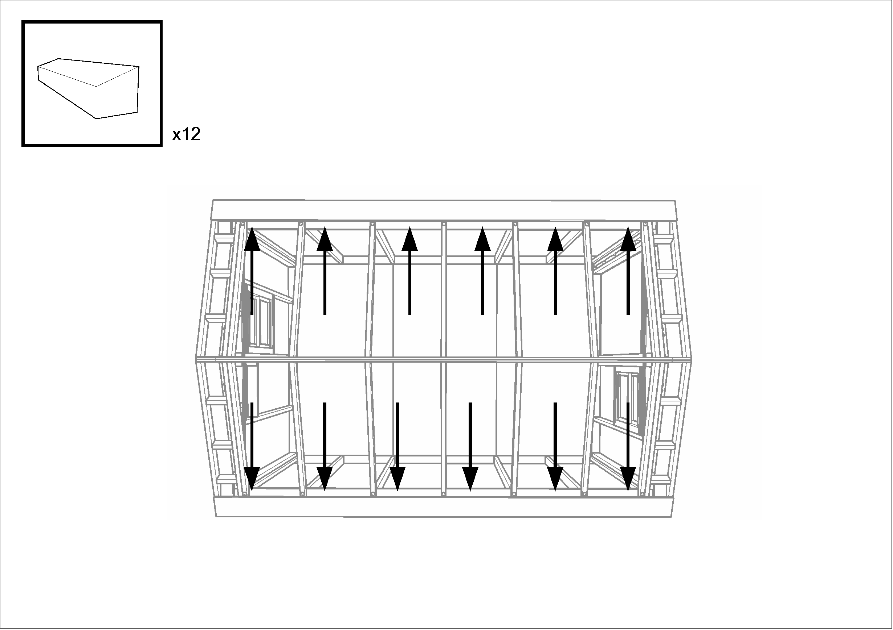



# Install Ridge Vent Blocks

*	Position a 1x8 white board (guide board) just down from the peak of the roof on one side; clamp it in place at both ends and in the middle.

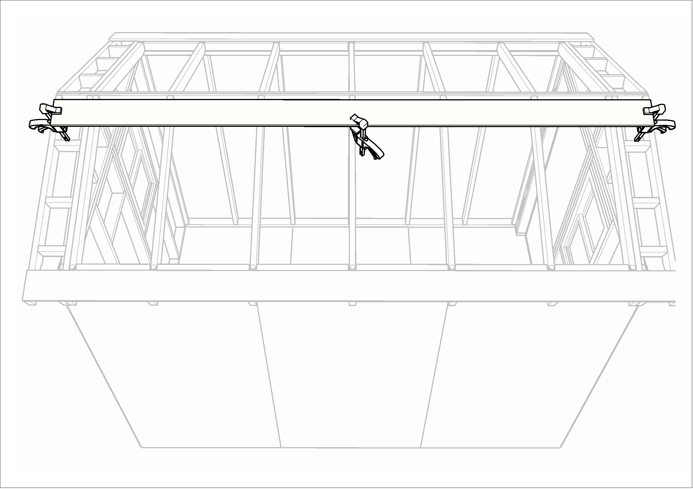

*	Collect a set of vent blocks from the tall shelves.  There should be 4 marked “END” and 8 unmarked.
*	Preset three #10 x 3” screws in each vent block.

## Align and Clamp Ridge Vent

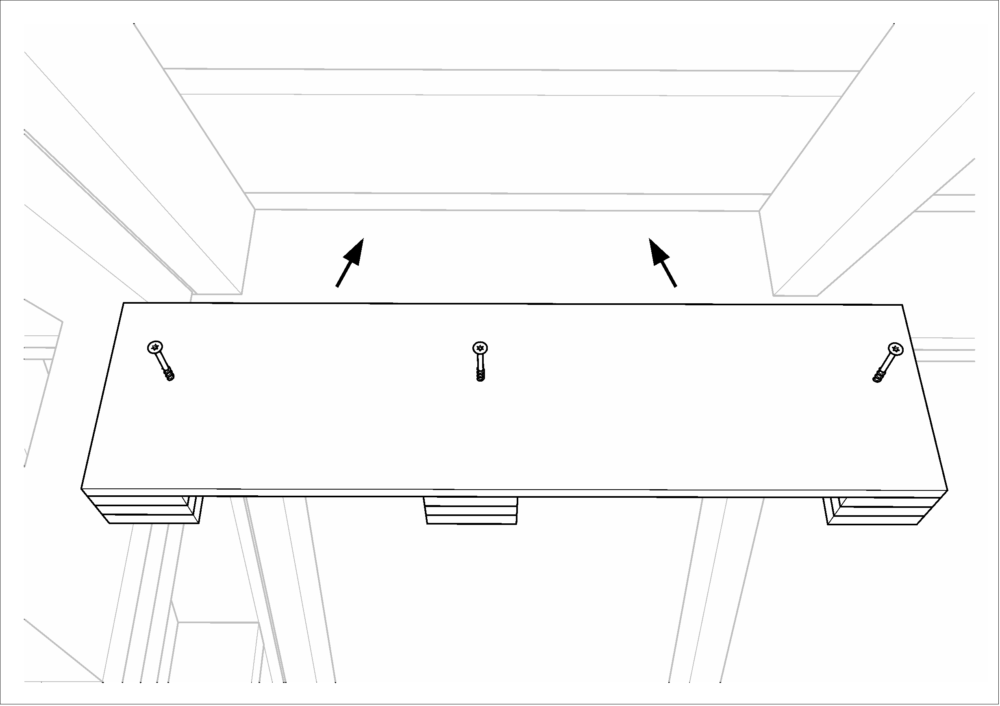

*	In each bay (between the rafters), position a vent block so that it just touches the guide board, clamp it in place, and drive the three screws into the white board.  If the vent block is too long, it can be cut off with a chop saw, but you may need to remove a screw for clearance.  It is important that the vent block end up tight against the white board.  If there is a gap, back the screws out, reclamp, and then drive the screws back in again.  This will ensure that the roof panels will actually fit when they are installed.

## Secure Ridge Vent

*	Move the guide board to the other side of the roof peak.
*	Install the remaining vent blocks on the other side of the roof peak.
*	Unclamp the guide board, and return it to the rack.

## Complete for All Ridge Vents

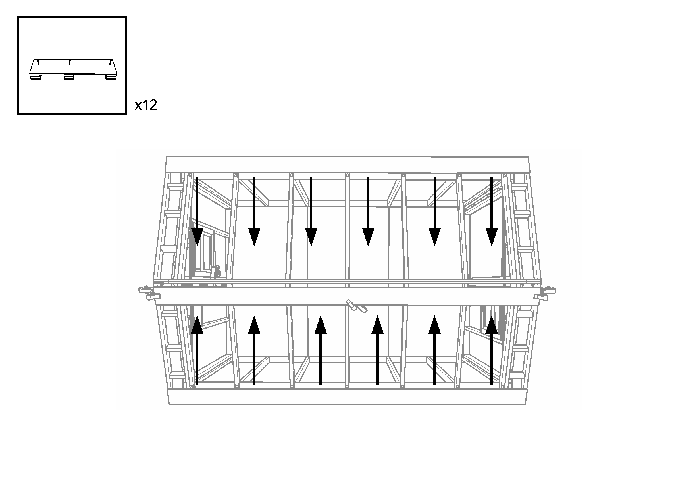