```{=typst}
#title-page[
  #text(36pt, weight: "bold")[Roof Blocking]
  #v(1em)
  #block(width: 60%)[#align(left)[#text(24pt)[Create Ridge Beam\
  Attach Rafters to Walls\
  Install Bird Blocks\
  Install Vent Blocks]]]
]
```

# Create Ridge Beam

* In each bay (between the rafters), clamp the two white boards together, first vertically and then horizontally, to align them and make a tight joint.
* insert four #8 x 1½" (yellow) screws, two above and two below the centerline, and about 4” from the rafters.  Alternate directions of the screws
  from one bay to the next.

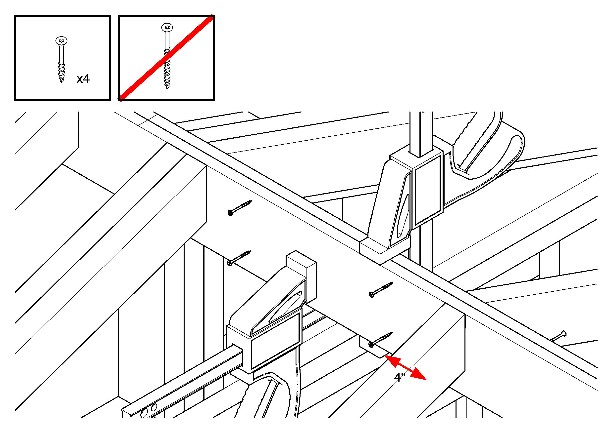

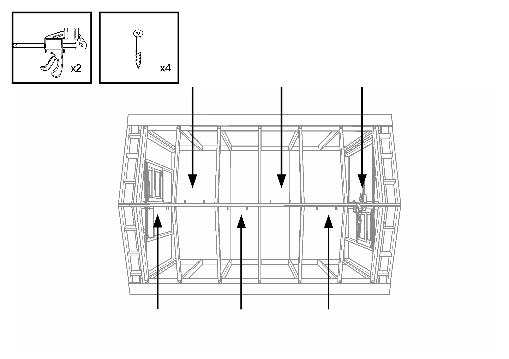

`#pagebreak()`{=typst}

# Align Half-Roof with Walls

* Using the angle-iron guide in Station #4, mark the centerline of the “magic” rafters; these are the ones to the rear of the second bay.
* Align the “magic” rafters with the stud just below them.  Using a clamp, pull each of these rafters either forward or back so that it
  lines up exactly with the wall stud immediately below it.  If necessary, have a second person use a mallet to assist.  The place to aim
  the mallet is on the outermost rafter at the point where the lowest block is screwed to the rafter.  If you hammer on the rafter end,
  something will split.

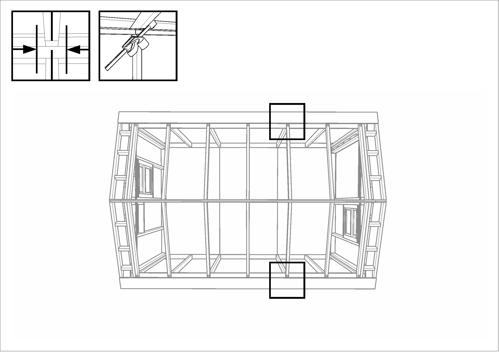

`#pagebreak()`{=typst}

# Install Magic Stud Lag Bolts

* Install lag bolts in these two rafters, screwing them down into the top plate of the side wall.

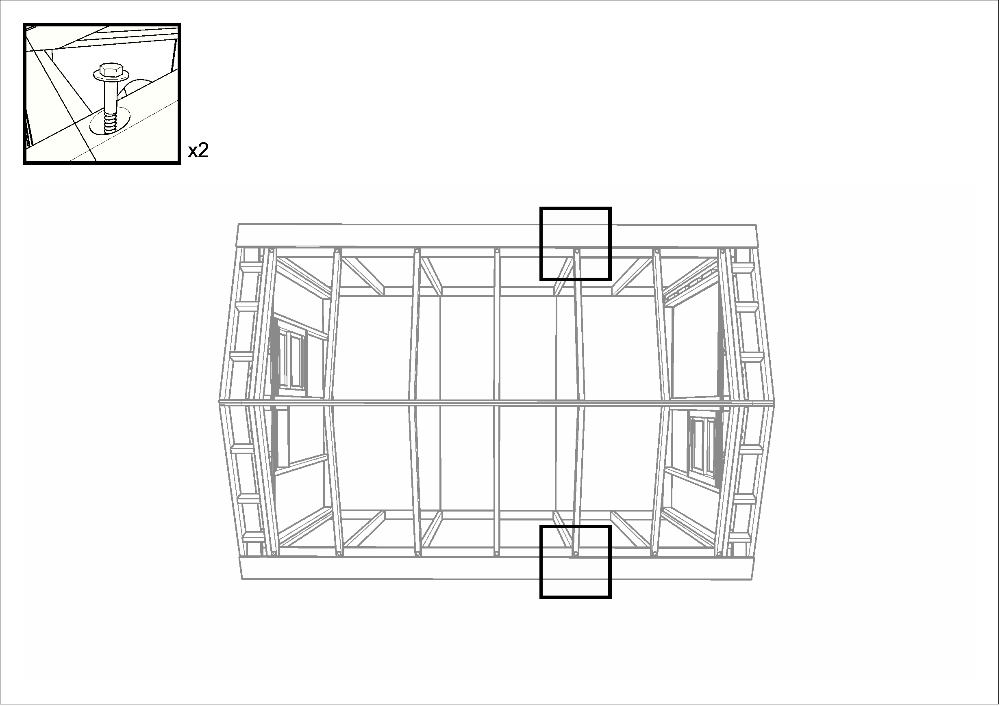

`#pagebreak()`{=typst}

## Secure Brackets

* At the peak of the roof, there are two steel brackets at each end of the roof.  Install three galvanized hex-head screws in each bracket
  to secure the roof to the structural triangles.

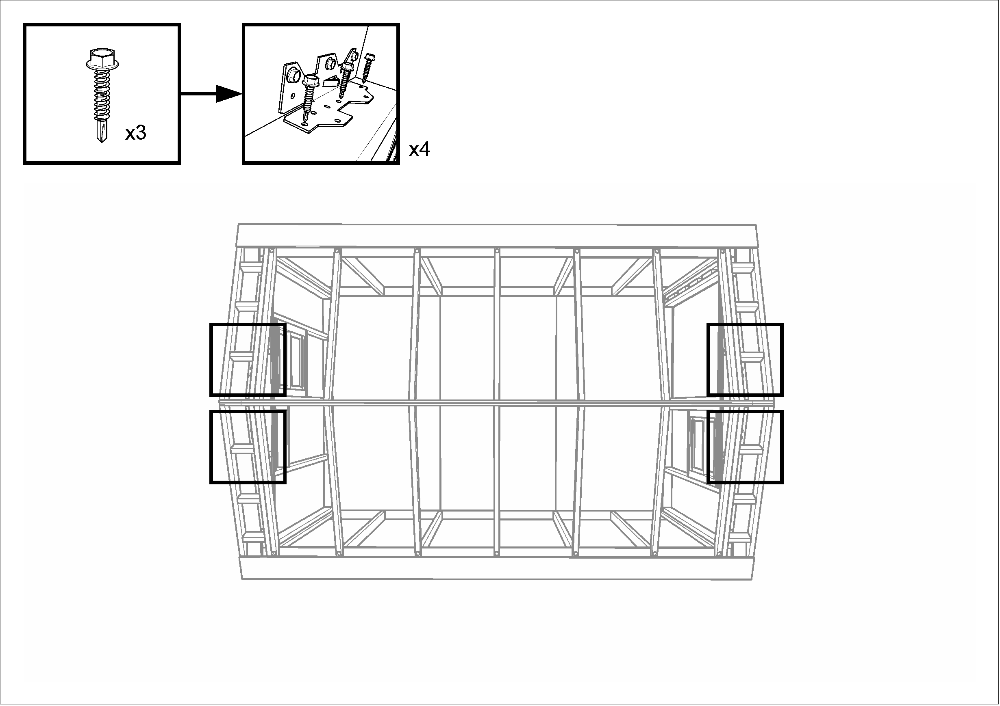

`#pagebreak()`{=typst}

# Install All Lag Bolts
* After these brackets are secured, install lag bolts in all the other rafters.

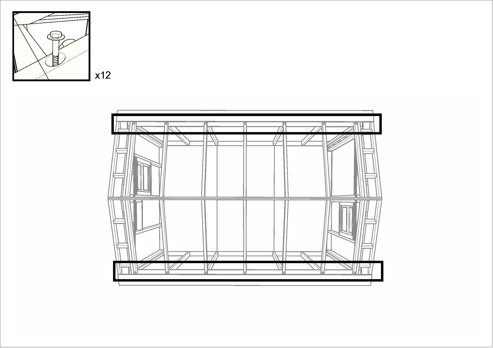

`#pagebreak()`{=typst}

# Install Bird Blocking
*  Collect a set of bird blocks from the tall shelves.  There should be four blocks labeled “E” (for the end bays) and eight blocks unlabeled
   (for the middle bays).
* One crew member is stationed on a ladder outside the home; the other, inside, has a screw gun and a box of #10 x 3" screws.
* The outside person positions each block, tapping gently with a mallet, so that it is flat against the top plate of the side wall,
  and tucked just under the edge of the white board at the bottom edge of the roof. If a block is shorter than the space between the rafters,
  it should be centered; if it is too long, cut it off with a chop saw.  The blocks must not protrude beyond the siding on the outside of the home.

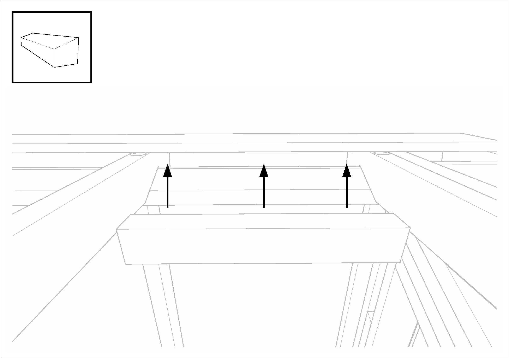


`#pagebreak()`{=typst}

## Attach Bird Blocking
* When a block is in position, the inside person drives two brown screws up through the top plate of the side wall into the bird block.
* The outside person then inspects the block to make sure that no screw ends are visible on the outside of the home. If one is found protruding,
  it must be removed and reinstalled correctly.


## Complete for All Bird Blocking

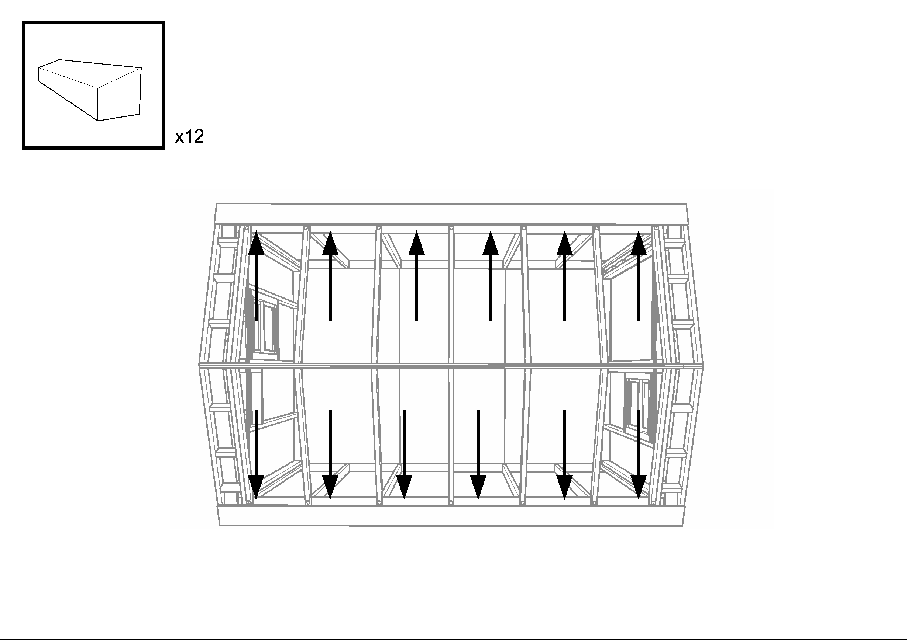

`#pagebreak()`{=typst}

# Install Ridge Vent Blocks
* Install vent jig between rafters (this jig does not fit into the end bays).

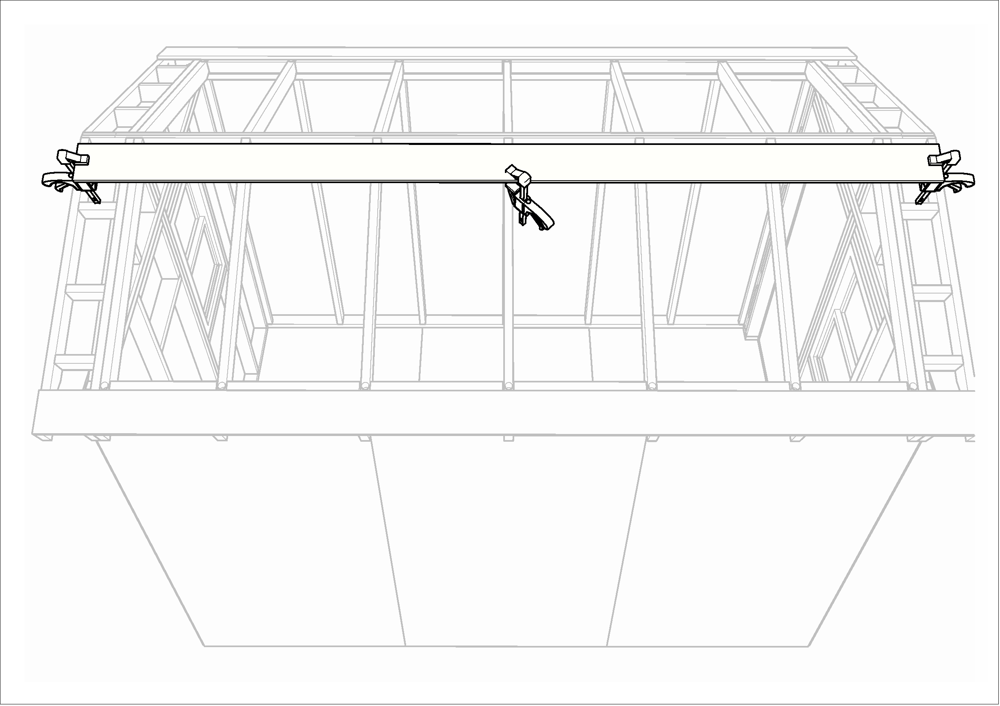

`#v(0.5in)`{=typst}

* Collect a set of vent blocks from the tall shelves.  There should be 4 marked “END” and 8 unmarked.
* Preset three #10 x 3” screws in each vent block.

## Align and Clamp Ridge Vent

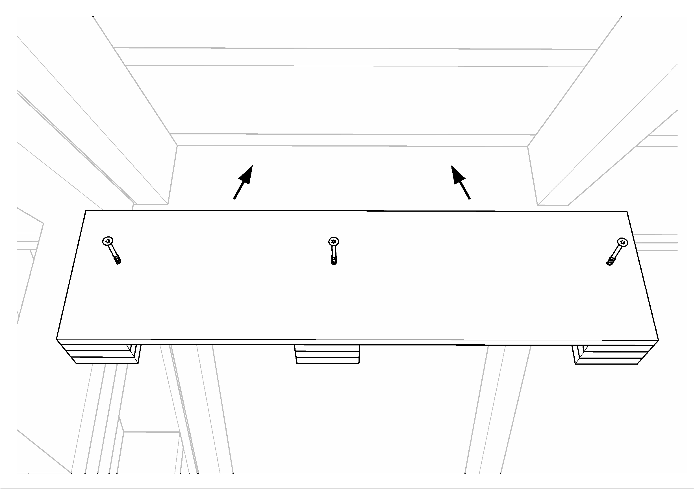

* Vent block assemblies have a top and a bottom.  The bottom is the edge where all the plywood spacer blocks are even.  Always install a
  vent block with this edge down.
* In each bay (between the rafters), position a vent block so that it just touches the vent jig, clamp it in place.
  If the vent block is too long, it can be cut off with a chop saw, but you may need to remove a screw for clearance.
* The vent jig will not fit into the end bays.  For these vent blocks, position each so that the top edge of the vent block (the long solid piece)
  is even with the top surface of the rafters on either side.  The vent block must not protrude higher than the rafter.
* Move the vent jig to the next bay before installing the next vent block.

`#pagebreak()`{=typst}

## Secure Ridge Vent

* Drive the three screws into the white board.  It is important that the vent block end up tight against the white board.
  If there is a gap, back the screws out, reclamp, and then drive the screws back in again.  This will ensure that the
  ceiling panels will actually fit when they are installed.


* Move the vent jig to the next bay, and repeat these two steps.

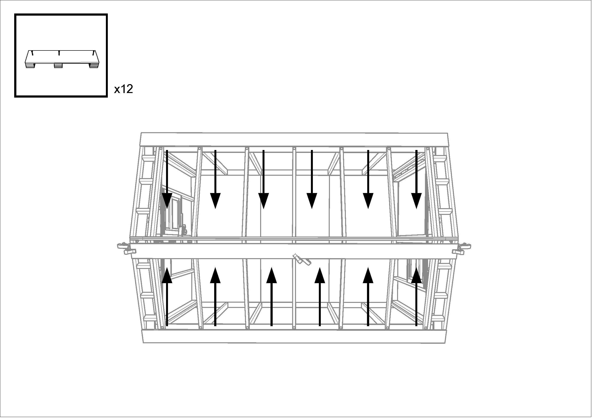