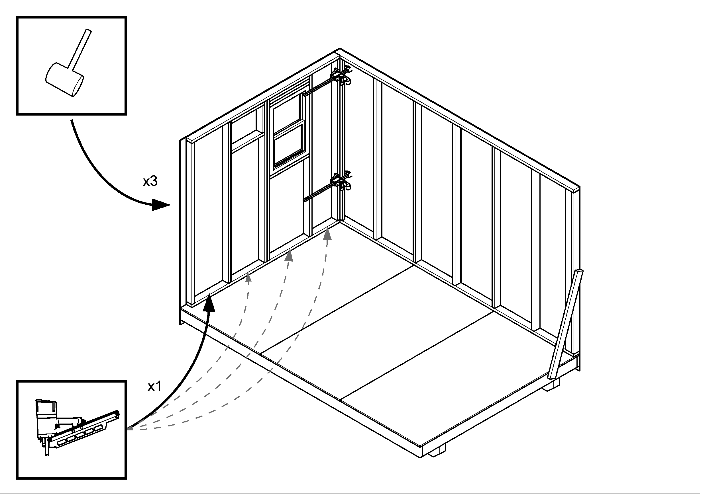
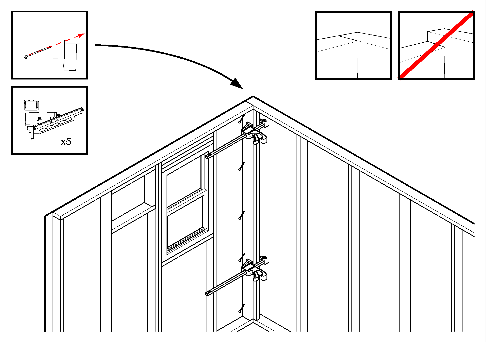
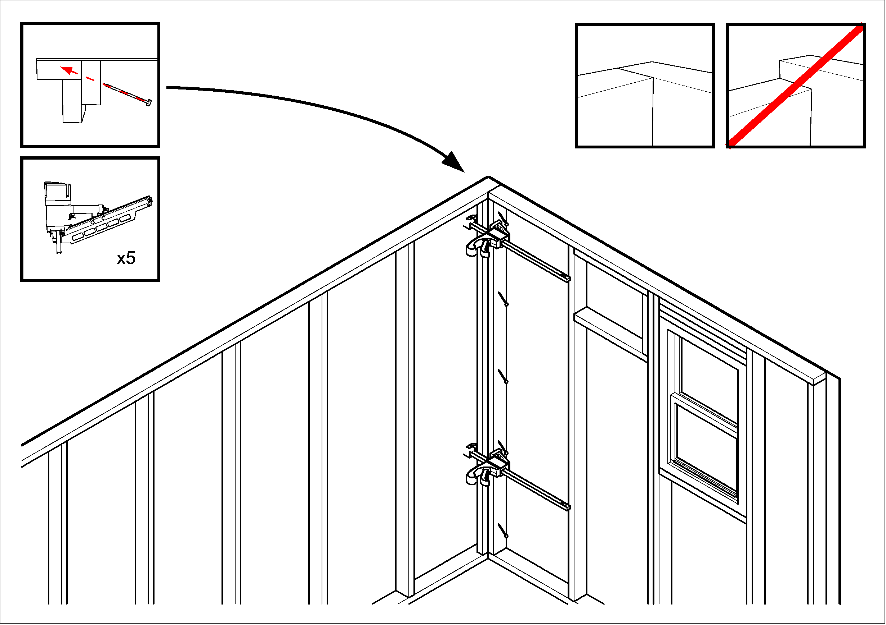
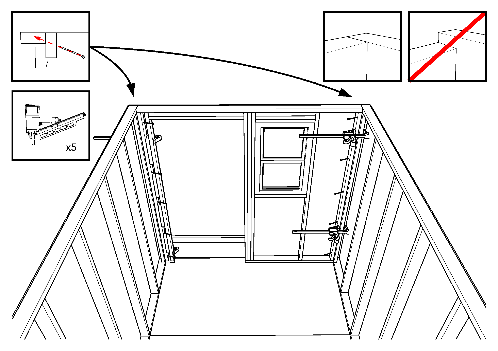

```{=typst}
#title-page[
  #text(48pt, weight: "bold")[Tilt-up]
  #v(1em)
  #text(24pt)[Instructions]
]
```
# Tiny Home Assembly

## Prepare Equipment

Before assembling a Tiny Home, all of the pieces must be complete.  Here are things to check:

### Platform

* Has any overhang been trimmed off the platform plywood?
* Are lines drawn on the platform to show where the bottom plates of each wall should line up?
* Have the alignment jigs been removed from the ends of the platform?
* Is the first-wall brace attached to the front of the platform?  It should be anchored about 2 feet in from the right-hand edge (as you face the front of the platform.)

### Walls

* Has any overhanging T1-11 siding been trimmed off the sides of both side walls?
* Has sawdust been swept off all four walls and the floor?
* Are all four walls up on blocks, so that they will lift out easily?

### Tools
* mallet
* Framing nail gun (with regular and galvanized framing nails)
* 2-step ladder
* clamps (4 total) – yellow clamps work best; small blue ones are not good
* screw gun with T25 bit
* 4-foot level

`#pagebreak()`{=typst}

## Leading the Tilt-Up Process
A comment we hear frequently from group-build participants is how excited they were to participate in making a difference -- that taking a home from sticks to framed-in during a single day was both exciting and eye-opening.  

As Team Leaders, one of our jobs in addition to safety and teaching the process, is to communicate the result too -- teaching the "why" of the process, not just the "how", and to do so in a way that includes group members as participants.  

Encourage the group to feel ownership of being a part of the solution.  Use "you" and "we" and "all of us" to indicate the role they're playing, and stay away from "me" and "us" that might seem to exclude them.  We're all a part of the solution and we want all of our volunteers to feel that, and to talk about it positively to friends, colleagues, and connections in the days that follow.

Start by being sure to introduce yourself to the group.  You probably built on the jigs earlier with a few group members, but the rest of the group won't know you.  A sample intro might go like this:

>>> "Hi, my name's Susan and I built a side wall with Jane and John this morning, and I'm going to be leading this tilt-up process.  In the next 45 minutes, we're going to take what we all built this morning and fasten it all together to create the bones of another new tiny home.  After that, we'll take a break while you hear about the human side of homelessness. Then we'll all come back together to raise the roof and get it all framed in.  Sound good?  Okay, let's get started!"

`#pagebreak()`{=typst}

## Prepare crew
Get everyone’s attention, and explain the first step; moving and tilting up the side wall.  

Assign three people to each side of the wall assembly, and three people on the platform to receive the wall. Use the ladder to get onto or off of the platform.

Check that everyone is wearing eye and ear protection, and has gloves on.

Remind wall transport crew to lift straight up and not pull the wall towards themselves, describe the shuffle step to move the wall toward the platform, and remind everyone to keep the wall level with the floor until it is clear of the jig.

Remind those at the far end of the wall to be sure to keep their fingers away from the bottom plate, so that they are not crushed when the wall is set in place.

Emphasize that when a leader taps someone on the shoulder and asks them to move away from the wall, they should do so briskly.

`#pagebreak()`{=typst}

## Tilt-up first side wall

### Prepare

**Assign crew**

* Transport: 3 people on each side of the wall
* Platform: 3 people on the platform

**Remind crews**

* Assign a team leader to call “clear” when the bottom edge of the wall is clear of the jig.
* Keep wall flat (horizontal) until the wall is completely clear of the jig.
* Transport crew use shuffle step
* Platform crew use leg muscles; keep your back straight.


`#pagebreak()`{=typst}

### Lift & Shift
* On the count of three, have the transport crew lift the wall from the jig, shuffle towards the platform, and pass the top of the wall
  to the platform crew.
* When the bottom of the wall paneling is clear of the jig, have the platform crew begin to raise the wall toward vertical,
  and have the remaining transport crew guide the bottom of the wall to line up with the layout mark on the platform edge.
* Remind transport crew to protect their fingers, and to step away from the wall when a team leader asks.


`#pagebreak()`{=typst}

### Align
* Use a mallet for fine adjustment to line up the ends of the wall with the ends of the platform.
* Have one person walk along the outside of the wall, using a mallet to drive the wall assembly tight against the platform.
  One good stroke in each of the 8” sections of each panel will do this.  Be sure to strike the wall paneling along the chalk line
  that was used to show where the panel was nailed to the bottom plate of the wall.
* If the wall bounces away from the platform (because the bottom plate isn’t particularly straight), have an experienced person
  fetch the wall lever from Workstation 2 or 4.
* Once the wall is in position, use the 4-foot level to set the wall vertical, and have a team leader secure the wall with the first-wall brace. 


`#fullpage("images/image_04.png")`{=typst}

### Attach
* If this is a group-build, favor group members for assignments below.
* Assign one person on the platform crew to be the nailer, and one person from the transport crew to be the mallet person.
  If it is necessary to use the wall lever, assign an experienced person to that task.  Usually, position the lever about 4 feet
  ahead of the point where the mallet strikes will occur.
* Tilt-up leader gives all instructions, so that crew know whom to listen to.  For this wall, the leader can be on the ground
  at the starting corner, and instruct both the mallet person and the nailer.
* Describe how coordination is required, but that these two people cannot see each other.  We use a cadence “One Mississippi,
  Two Mississippi, Three Mississippi” so that the nail gun person can anticipate the 3rd stroke.  Ask the crowd to rehearse this.
* Instruct the nail gun person
    * One nail in the middle of each wall bay.
    * “One Mississippi”: set the gun in position.
    * “Two Mississippi” press the gun down.  Stress waiting for this, to avoid gun timeout.
    * “Three Mississippi” fire the nail gun when the mallet strikes.
* Have the mallet person begin at one end of the wall, aiming for the chalk line, and halfway between the nails that mark
  where the studs for the first bay are positioned.
* If the first nail is successfully driven, move both the mallet person and the nail gun person to the next wall bay, and repeat,
  until each bay is nailed to the platform.  When the nail gun person is set, call out “Ready” to let the mallet person know that
  they can begin the next sequence.


`#pagebreak()`{=typst}

## Tilt up rear wall

### Prepare
* Rotate bystanders into the transport crew, and assign three people to the two sides of the rear wall.
* Make sure that the transport crew know to lift the rear wall using the 2x4s under the panel edges, rather than by lifting the panels.
* Remind the transport crew of the path they will take, shuffling sideways until the wall is clear of the jig, then towards the platform
  (with three people backing up), and handing the top of the wall to the platform crew.
* Emphasize that, when the wall is being tilted up, they should aim to leave about a foot of space between the rear wall and the side wall
  that is already installed.
* Remind everyone of safety concerns:
    * Keep fingers clear of the bottom of the wall as it is set in place
    * Be aware of where the platform edge is, especially for those backing up.  The person labeled B needs to be especially aware that
      they may back into a corner of the platform.
    * As the wall is being raised, the people on the transport team (A and B) must drop out and move away, leaving the wall
      in the hands of the platform crew. 
    * Once the wall is set down, those near the corner must keep their hands away from the corner as the wall is slid into place


`#pagebreak()`{=typst}

### Lift & Shift
* On the count of three, have the transport crew lift the wall off the jig, shuffle sideways until the wall is clear of the jig,
  and then walk slowly toward the platform with the wall.
* As they hand the wall to the platform crew, the leading-edge transport people should drop away, so that they are not impeding the movement of the wall.

`#scale(70%, reflow: true)[#image("images/image_07.png")]`{=typst}

`#scale(70%, reflow: true)[#image("images/image_08.png")]`{=typst}

* When the wall is about a foot away from the side wall, the platform crew starts lifting the wall into position.  The remaining transport crew
  can help guide the bottom of the wall into the marked position on the platform, being careful to keep fingers away from the bottom of the wall.
* Once the wall is vertical, the leader **must verify** that everyone’s fingers are out of the way of the corner about to be joined.
  When that is so, the leader calls for the transport and platform crew to push and slide the rear wall against the end of the side wall.


`#scale(78%, reflow: true)[#image("images/image_10.png")]`{=typst}

`#scale(78%, reflow: true)[#image("images/image_11.png")]`{=typst}

`#pagebreak()`{=typst}

### Align
* As before, have a mallet person go along the outside of the rear wall, stroking every 8” to tighten the rear wall against the platform,
  and, if necessary, adjust the position of the wall side-to-side.
* From inside the home, position a clamp on the 2x4s forming the corner about 2 feet above the bottom of the wall, and tighten the corner joint.
* Have a tall person use the mallet to hammer the rear-wall paneling tight against the side wall framing, all the way up to the top of the walls.
  Then install a second clamp inside the home near the top of the corner.
* Check that there is no gap between the back wall siding and the end wall, all the way from the bottom to the top of the corner,
  and that the two walls are even at the top.


`#pagebreak()`{=typst}

### Attach Bottom Plate
* As before, assign a nailer (from the platform crew) and a mallet person (from the transport crew)
* Review the “Mississippi” timing ritual, and nail the bottom plate of the rear wall to the platform, one nail per wall bay



`#pagebreak()`{=typst}

### Attach Corner
* Verify that the top of the two walls are tightly clamped together, and are at the same height.
* Have the nailer shoot 5 nails into the corner, about 2 feet apart, centered on the rear wall side stud, and angled outward, so that the nail 
  is driven into the side stud of the side wall, rather than going into the crack between the two pieces of wood that form the corner on the side wall.
* Remove the clamps



`#pagebreak()`{=typst}

## Tilt-up second side wall

### Prepare
* Choose one person to be the target for the platform move.  Have them stand a foot or so beyond where the home will move to.
* Using the ladder, have everyone move off the platform, remove the 2-step ladder and the wheel chocks, and move the assembly forward to the
  next station in the assembly line.  The target person can count down “3 feet, 2 feet, 1 foot, whoa!”
* When the assembly is in position, reinstall the wheel chocks, position the wooden steps at the front of the home, and use them to allow
  the platform crew to return to the platform.
* Have someone remove the first-wall brace.
* As before, if there are extra people, rotate new people into the transport crew, and have three people in position on each side of the second side wall.
* Describe the path for this wall: in must be kept parallel to the floor until the far edge of the wall panel is clear of the jig, and then it can
  tilt up, and be set on the edge of the platform about a foot away from the corner with the rear wall.
* Remind everyone of safety concerns:
    * Keep fingers clear of the bottom of the wall as it is set in place
    * As the wall is being raised, the top and middle people on the transport team (A and B) must drop out and move away, leaving the wall
      in the hands of the platform crew.  Ask these people to follow team leader’s requests briskly.
    * Do not slide the wall until told that it is safe
    * Once the wall is set down, those near the corner must keep their hands away from the corner as the wall is slid into place.
    * After the wall is in place, the platform crew must continue to steady it, until nailing is complete.

`#fullpage("images/image_15.png")`{=typst}

### Lift & Shift
* On the count of three, have the transport crew lift the wall, shuffle towards the platform, pass the top of the wall to the platform crew,
  and, once the wall is clear of the jig, tilt the wall up and place the bottom 2x4 on the platform edge with the rear edge about a foot away
  from the back wall.
* Once the side wall is vertical, the leader **must verify** that everyone’s fingers are out of the way of the corner about to be joined.
  When that is so, the leader may call for the transport and platform crew to slide the side wall against the end of the rear wall.


`#scale(78%, reflow: true)[#image("images/image_17.png")]`{=typst}

`#scale(78%, reflow: true)[#image("images/image_18.png")]`{=typst}

`#pagebreak()`{=typst}

### Align
* As necessary, use a mallet to adjust the position of the side wall so that the wall ends line up with the platform ends.
* As before, have a mallet person go along the outside of the side wall, stroking every 8” to tighten the wall against the platform.
* From inside the home, position a clamp on the 2x4s forming the rear corner about 2 feet above the bottom of the wall, and tighten the corner joint.
* Have a tall person use the mallet to hammer the rear-wall paneling tight against the side wall framing, all the way up to the top of the walls.
  Then install a second clamp inside the home near the top of the corner.


`#pagebreak()`{=typst}

### Attach Bottom
* As before, assign a nailer and a malleter, review the “Mississippi” timing ritual, and nail the bottom plate of the side wall to the platform,
  one nail per wall bay.  If it is necessary to use the wall lever, assign a third person to that task.


`#pagebreak()`{=typst}

### Attach Corner
* Verify that the tops of the two walls are tightly clamped together, and have the nailer shoot 5 nails into the corner, about 2 feet apart,
  centered on the rear wall side stud, and angled outward, so that the nail ends up driven into the side stud of the side wall, rather than
  going into the crack between the two pieces of wood that form the corner on the side wall. 
* Remove the clamps



`#pagebreak()`{=typst}

## Tilt-up front wall

### Prepare
* If there are more people than the minimum, rotate bystanders into the transport crew, and assign three people to each side of the rear wall.
  Make sure that two experienced crew members are assigned to the plastic wall-bottom hooks.
* Make sure that the transport crew know to lift the rear wall using the 2x4s under the panel edges, rather than by lifting the panels.
* Describe the handling for this fourth wall: two experienced people will use the large plastic hook handles to support the bottom of the wall
  as it is being tilted up.  The platform crew will lift the wall from inside the home.  The transport crew must hand off the wall to these people
  and keep their hands out of the corner areas of the home.
* Remind the transport crew of the path they will take, shuffling sideways until the wall is clear of the jig, then towards the platform
  (with three people backing up), and handing the top of the wall to the platform crew.
* Remind crew of safety concerns:
    * As noted above, transport crew must let go of the wall when told to do so by the hook lifters, and not come back.
    * Platform crew must handle the wall by inner studs and window blocking.  Keep all fingers away from both corners during this tilt-up.
    * Instruct platform crew to use elbows or shoulders to tip the side walls away if more room is needed to get the front wall into position.
    * Once the front wall is set in place, platform crew must continue to support it until clamps are in place on both corners.


`#pagebreak()`{=typst}

### Lift & Shift
* Once the platform crew are in place and the team leader is back on the platform, have ground crew members move the steps away from the front of the home.
* On the count of three, have the transport crew lift the wall off the jig, shuffle sideways until the wall is clear of the jig,
  and then walk slowly toward the platform with the wall.
* The transport crew pass the top of the front wall to the platform crew, who keep the two wings of the front wall outside the home,
  and lift the top of the wall up.  If the side walls need to be deflected to make space, platform crew can use elbows or shoulders.
  The two plastic-hook people bear much of the weight of the wall, and they guide the wall into the opening.  The leader’s job at this time
  is to make certain that everyone else has their fingers out of the way.


`#pagebreak()`{=typst}

`#scale(78%, reflow: true)[#image("images/image_24.png")]`{=typst}

`#scale(78%, reflow: true)[#image("images/image_25.png")]`{=typst}

`#pagebreak()`{=typst}

`#scale(78%, reflow: true)[#image("images/image_26.png")]`{=typst}

`#scale(78%, reflow: true)[#image("images/image_27.png")]`{=typst}

`#pagebreak()`{=typst}

### Align
* Once the front wall is in position, have a mallet person go along the outside of the front wall, stroking every 8” to tighten the wall
  against the platform.
* From inside the home, position clamps on the 2x4s forming the corners about 2 feet above the bottom of the wall, and tighten each corner joint.
* Have a tall person use the mallet to hammer the front-wall paneling tight against the side wall framing, all the way up to the top of the walls.
  Then install a second clamp inside the home near the top of each corner.


`#pagebreak()`{=typst}

### Attach Bottom
*	As before, assign a nailer and a malleter, review the “Mississippi” timing ritual, and nail the bottom plate of the front wall to the platform, one nail per wall bay.  Finish with a nail into the small space between the two studs next to the door corner.


`#pagebreak()`{=typst}

### Attach Corners
* Verify that the tops of the two walls are tightly clamped together, and have the nailer shoot 4 nails into the corner next to the window,
  about 2 feet apart, about centered on the front wall side stud, and angled outward, so that the nail is driven into the side stud of the side wall,
  rather than going into the crack between the two pieces of wood that form the corner on the side wall.
* Similarly, check the corner next to the door for tightness, and have the nailer shoot a nail into each gap between the spacer blocks, angled outward.
* Remove the clamps


